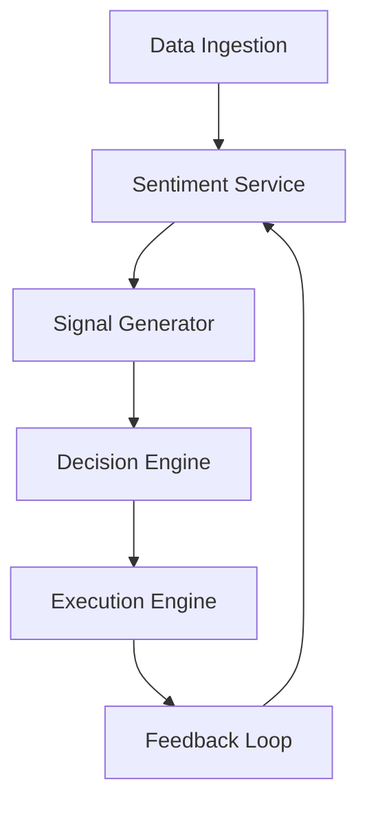

co
## 🔐 Encrypted Multi-Provider API KeySafe

- All API keys are **AES-encrypted** at rest using `cryptography`.
- Supports **multiple providers** (OpenAI, Requestly, DeepSeek, OpenRouter, etc.).
- Handles **multiple keys per provider** with priority and failover.
- Keys are **decrypted only at runtime**, never stored plaintext.
- Master encryption key managed via **environment variable** or **secret manager**.
- Enables **secure, dynamic, production-ready key management**.
- See `src/api/key_manager.py` for implementation.

# Elite AI Trading System with Trading-Hero-LLM

---

## Overview

An advanced, modular AI trading platform integrating **Trading-Hero-LLM** (FinBERT fine-tuned for finance) for real-time sentiment analysis, combined with technical and fundamental data to generate actionable trading signals.

---

## Features

- **Financial Sentiment Analysis:**  
  Powered by Trading-Hero-LLM with Apple Silicon acceleration (MPS).

- **Real-Time Data Ingestion:**  
  News, social media, reports, and market data.

- **Multi-Modal Signal Generation:**  
  Combines sentiment, technical indicators, and fundamentals.

- **Decision Engine:**  
  Portfolio-aware, risk-managed trade decisions.

- **Execution Engine:**  
  Broker API integration (simulated, extendable).

- **Feedback Loop:**  
  Trade logging, performance analysis, retraining triggers.

- **Modular Architecture:**  
  Easily extendable and maintainable.

- **Deployment Ready:**  
  Supports batch, async, or microservice orchestration.

---

## Architecture



---

## Installation

1. **Clone the repository:**

```bash
git clone https://github.com/yourusername/elite-ai-trading.git
cd elite-ai-trading
```

2. **Create and activate virtual environment:**

```bash
python3 -m venv .venv
source .venv/bin/activate
```

3. **Install dependencies:**

```bash
pip install --upgrade pip
pip install -r requirements.txt
```

4. **Download Trading-Hero-LLM model (auto-download on first run).**

---

## Usage

Run the sentiment-enhanced pipeline:

```bash
PYTHONPATH=. python3 src/ai_trading_framework/sentiment_pipeline.py
```

Or integrate modules individually:

- `data_ingestion.py`
- `sentiment_service.py`
- `signal_generator.py`
- `decision_engine.py`
- `execution_engine.py`
- `feedback_loop.py`

---

## Memory Bank Documentation

See `memory-bank/` for:

- Product context
- Architecture plans
- Integration & deployment strategy
- Decision logs
- Progress tracking

---

## Contributing

- Fork and branch from `main`
- Follow modular design patterns
- Update Memory Bank docs on major changes
- Ensure `.gitignore` excludes large files, secrets, and data

---

## License

[MIT License](LICENSE)

---

## Acknowledgments

- [Hugging Face Transformers](https://huggingface.co)
- [PyTorch](https://pytorch.org)
- [FinBERT](https://github.com/ProsusAI/finBERT)
- [Apple Silicon MPS acceleration](https://developer.apple.com/metal/)
