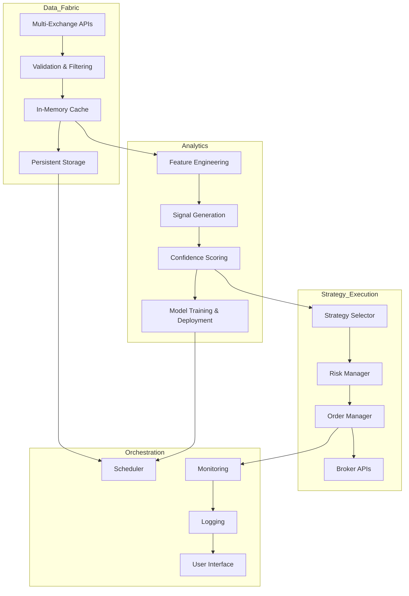

# Autonomous Crypto Trading System - Foundational Architecture

*Generated 2025-04-06 19:26 UTC+1*

---

## Core Design Principles

- **Modularity:** Isolated, swappable components.
- **Extensibility:** Easy integration of new data sources, models, strategies.
- **Fault Tolerance:** Fallbacks, retries, graceful degradation.
- **Performance:** Ultra-low latency, scalable.
- **Transparency:** Logging, explainability, auditability.
- **Continuous Learning:** Self-improving with minimal intervention.

---

## Architecture Layers

### 1. Data Fabric

- Multi-exchange ingestion (Binance, Kraken, Coinbase, etc.).
- Real-time (WebSocket) + historical (REST) data.
- Cross-source validation, anomaly rejection.
- High-speed in-memory cache (RAM) + persistent storage (DB).
- Versioned, labeled datasets for ML.

### 2. Analytics & Intelligence

- Multi-timeframe signal generation.
- Confidence scoring, historical pattern matching.
- Feature engineering, auto-labeling.
- Model training, validation, deployment.
- Continuous monitoring & retraining.

### 3. Strategy & Execution

- Multi-mode strategies (HFT, swing, arbitrage).
- Dynamic risk management.
- Broker/exchange API abstraction.
- Order management, execution monitoring.
- Simulation, paper trading, live modes.

### 4. Orchestration & Monitoring

- Task scheduling, pipeline management.
- Logging, alerting, visualization.
- Performance metrics, health checks.
- User override interface (optional).

---

## Data & Control Flow

---

## Initial Focus

- **Robust Data Fabric:** Multi-source, validated, high-speed.
- **Analytics Core:** Multi-resolution, confidence-scored signals.
- **Execution Skeleton:** Modular, risk-aware order management.
- **Documentation:** Clear specs, diagrams, rationale.

---

## Extension Points

- Add new exchanges, data types.
- Plug-in new ML models.
- Expand strategy library.
- Integrate advanced risk controls.
- Build UI/dashboard.

---

*This foundation ensures a scalable, resilient, and extensible autonomous trading system.*