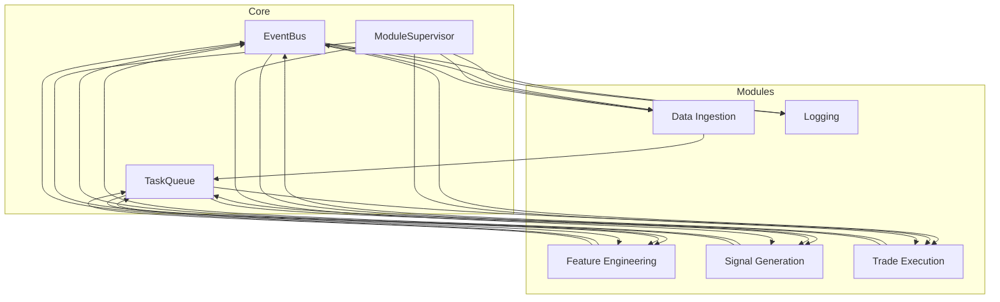

# Event-Driven Core Engine Design

*Generated 2025-04-06 19:51 UTC+1*

---

## Purpose

Create a **modular, async, event-driven core** for the unstoppable trading engine, enabling:

- Clean separation of modules
- Real-time async orchestration
- Bulletproof error handling
- Self-healing and zero downtime

---

## Components

### 1. EventBus
- Async pub/sub message bus.
- Modules publish events, subscribe to topics.
- Supports broadcast and targeted messages.

### 2. TaskQueue
- Asyncio queues for ingestion, processing, execution.
- Bounded size, backpressure support.
- Priority queues for critical tasks.

### 3. ModuleSupervisor
- Monitors all modules.
- Restarts failed modules automatically.
- Logs errors and recovery actions.

### 4. BaseModule
- Abstract async module class.
- Handles startup, shutdown, error propagation.
- Registers with EventBus and Supervisor.

---

## Data & Control Flow

---

## Key Features

- **Async, event-driven communication**
- **Isolated, restartable modules**
- **Priority task handling**
- **Minimal latency, high throughput**
- **Transparent error logging and recovery**

---

## Next Step

- **Switch to Code mode**
- **Implement `core_engine.py`** with these components
- **Integrate into unstoppable trading engine**

---

*This design ensures a featherweight, resilient, unstoppable event-driven core.*