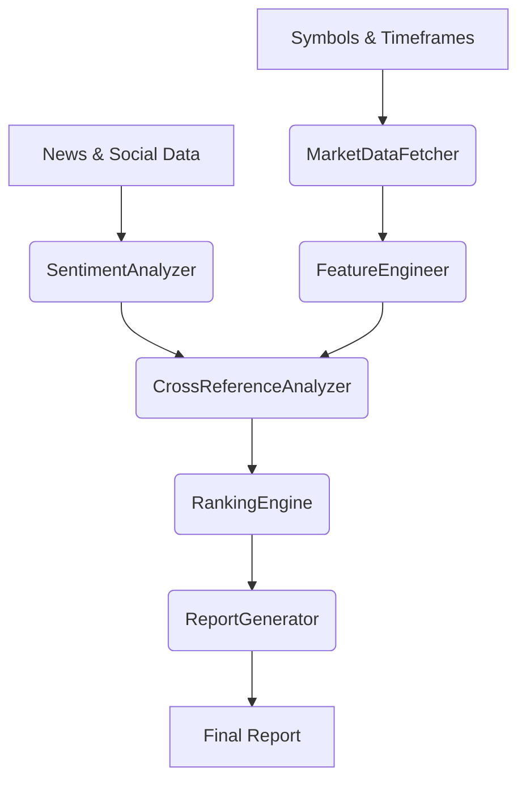

# Expanded Architecture: Multi-Source Crypto Market Analysis

*Generated 2025-04-06 19:18 UTC+1*

---

## Objective
Integrate multi-timeframe candlestick data with sentiment analysis, perform parallelized analytics, and generate prioritized buy recommendations.

---

## 1. Modules

### MarketDataFetcher
- Fetches OHLCV data for all symbols/timeframes.
- Multi-threaded/multi-core.
- Handles retries, errors.

### SentimentAnalyzer
- Uses Trading-Hero-LLM (`trading_hero_llm.py`).
- Batch processes news/social media.
- Outputs sentiment scores.

### FeatureEngineer
- Computes technical indicators.
- Detects candlestick patterns.
- Aggregates sentiment.

### CrossReferenceAnalyzer
- Correlates sentiment with price trends.
- Detects anomalies/events.
- Produces composite scores.

### RankingEngine
- Ranks cryptocurrencies.
- Based on composite analytics.

### ReportGenerator
- Generates Markdown/JSON report.
- Includes rationales and insights.

---

## 2. Data Schemas

### Candlestick Data
| symbol | timeframe | timestamp | open | high | low | close | volume |

### Sentiment Data
| symbol | timestamp | source | text | sentiment | score |

### Feature Vector
| symbol | timeframe | timestamp | indicators | patterns | sentiment_score | event_flags |

---

## 3. Parallelization

- **MarketDataFetcher:** ThreadPool/async.
- **SentimentAnalyzer:** Batch + multi-core.
- **FeatureEngineer:** Vectorized.
- **CrossReference:** Parallel per symbol.

---

## 4. Integration Points

| Module               | Existing Component                     | Notes                                           |
|----------------------|----------------------------------------|-------------------------------------------------|
| MarketDataFetcher    | Extend `data_ingestion.py`             | Real API integration                            |
| SentimentAnalyzer    | `trading_hero_llm.py`                  | Use existing HF model                           |
| FeatureEngineer      | Extend or new                          | Technical + sentiment features                  |
| CrossReferenceAnalyzer | New                                 | Combine features                                |
| RankingEngine        | New                                   | Scoring logic                                   |
| ReportGenerator      | New                                   | Markdown/JSON output                            |

---

## 5. Data & Control Flow

---

## 6. Open Questions

- Which exchange APIs?
- Sentiment-symbol mapping method?
- Report frequency?
- Storage backend?

---

## 7. Next Steps

- Confirm data sources.
- Design API call structure.
- Define batching configs.
- Prepare implementation specs.