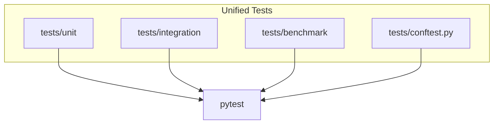

# Test Consolidation & Cleanup Plan (2025-04-06 18:37)

---

## Objective

Unify all scattered test files into a **single `tests/` directory** to:

- Eliminate import errors
- Simplify test discovery
- Improve maintainability

---

## Current Issues

- Tests scattered in:
  - `src/tests/`
  - `robinhood-ai-trading-bot/tests/`
  - `robin_stocks/tests/`
- Duplicate `conftest.py` files causing import conflicts
- Nested packages confusing pytest
- Import path mismatches

---

## Target Structure

```plaintext
/tests
  /unit
  /integration
  /benchmark
  conftest.py
  __init__.py
```

---

## Steps

1. **Create `/tests` root directory** if not exists.
2. **Move all test files** into appropriate subfolders:
   - Unit tests → `/tests/unit/`
   - Integration tests → `/tests/integration/`
   - Benchmarks → `/tests/benchmark/`
3. **Add `__init__.py`** to all test folders.
4. **Update imports** inside test files to reflect new relative paths.
5. **Remove duplicate or nested `conftest.py`** files.
6. **Clean caches:**

```bash
find . -name "__pycache__" -type d -exec rm -rf {} +
find . -name "*.pyc" -delete
```

7. **Update `pytest.ini`:**

```ini
[pytest]
testpaths = tests
python_files = test_*.py
```

8. **Re-run full test suite:**

```bash
python3 -m pytest tests/ -v
```

---

## Diagram



---

## Expected Outcome

- No more import errors
- Clean, maintainable test suite
- Easier CI/CD integration
- Accurate full system validation

---

*End of Plan*