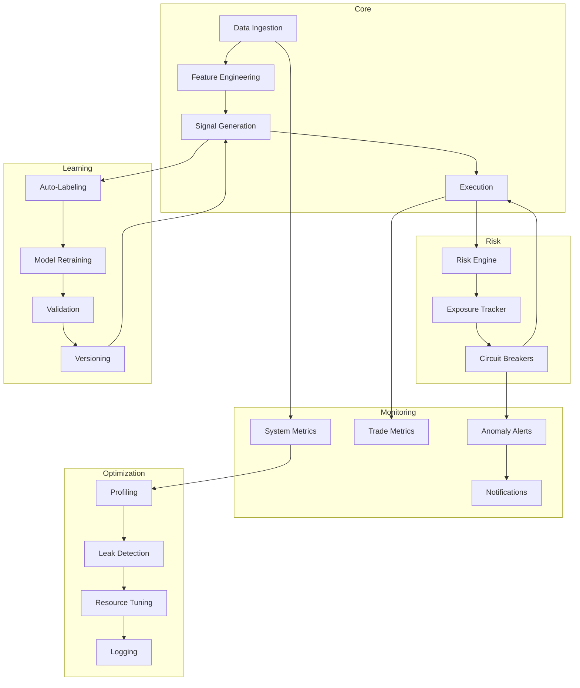

# Unstoppable Trading Engine - Next Phase Architecture

*Generated 2025-04-06 20:58 UTC+1*

---

## 1. Advanced Risk Management

- Dynamic position sizing (volatility, confidence, exposure)
- Real-time portfolio risk tracking
- Max drawdown, max loss, max exposure enforcement
- Circuit breakers on breach
- Adaptive stop-loss/take-profit
- Dynamic asset blacklisting
- Anomaly-triggered risk adjustments

---

## 2. Continuous Learning Pipeline

- Auto-label trade outcomes
- Scheduled retraining with new data
- Walk-forward validation
- Model versioning and rollback
- Online incremental learning
- Automated hyperparameter tuning

---

## 3. Monitoring & Alerting

- Real-time dashboards (Grafana, Prometheus)
- System health: latency, CPU, memory, errors
- Trading metrics: win rate, Sharpe, drawdown
- Anomaly alerts
- Telegram/Slack notifications
- Emergency override controls

---

## 4. Self-Optimization

- Runtime profiling (latency, memory)
- Leak detection, GC tuning
- Bottleneck elimination
- Adaptive resource allocation
- Logging of optimization actions

---

## 5. Data & Control Flow

---

## Summary

This next phase ensures the unstoppable engine is:

- **Safer** with adaptive, multi-layered risk controls
- **Smarter** with continuous learning and model evolution
- **More transparent** with real-time monitoring and alerts
- **Faster and leaner** with self-optimization

---

*Ready for implementation.*