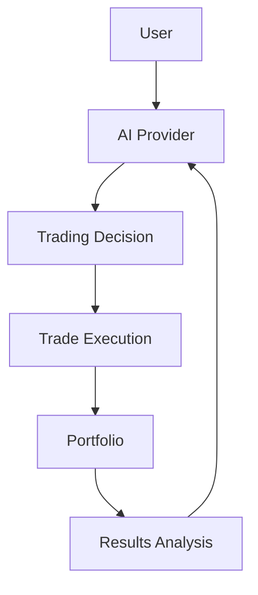
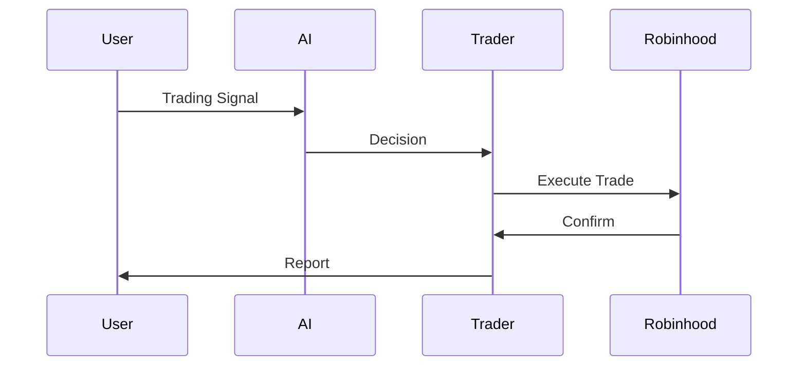

# Robinhood AI Trading Bot - Multi-API Support



## System Architecture

```
┌───────────────────────┐    ┌───────────────────────┐
│                       │    │                       │
│    AI Provider        │◄───┤  Trading Decision     │
│   (Multi-API)         │    │   Engine              │
│                       │───►│                       │
└───────────────────────┘    └───────────────────────┘
        ▲                           ▲
        │                           │
        ▼                           ▼
┌───────────────────────┐    ┌───────────────────────┐
│                       │    │                       │
│   Market Data         │    │   Trade Execution     │
│   Collector           │    │   (Robinhood API)     │
│                       │    │                       │
└───────────────────────┘    └───────────────────────┘
```

## Memory Bank System

```
MEMORY BANK STRUCTURE:
├── productContext.md    - High-level project goals
├── activeContext.md     - Current focus/status  
├── systemPatterns.md    - Architectural patterns
├── decisionLog.md       - Key decisions
└── progress.md          - Task tracking
```

## AI Provider Configuration

The system supports multiple AI providers through a unified interface:

### Supported Providers
- OpenAI
- Deepseek 
- Requestly
- OpenRouter

### Setup Instructions

1. Add API keys to your `.env` file:
```
OPENAI_API_KEY=your_openai_key
DEEPSEEK_API_KEY=your_deepseek_key  
ROUTER_API_KEY=your_requestly_key
OPENROUTER_API_KEY=your_openrouter_key
OPENROUTER_REFERRER=https://github.com/siropkin/robinhood-ai-trading-bot
OPENROUTER_APP_NAME=Robinhood AI Trading Bot
```

2. Install dependencies:
```bash
pip install -r requirements.txt
```

### Usage Examples

```python
from ai_provider import AIProvider, make_ai_request

# Basic usage with default provider (OpenAI)
response = make_ai_request("Your prompt here")

# Specific provider with custom model
response = make_ai_request(
    "Your prompt here",
    provider=AIProvider.OPENROUTER,
    model="anthropic/claude-2"
)
```

## Trading Flow



## Project Structure

```
robinhood-ai-trading-bot/
├── src/
│   ├── api/              - API integrations
│   ├── utils/            - Shared utilities
├── tests/
│   ├── integration/      - End-to-end tests
│   ├── unit/             - Component tests
├── memory-bank/          - Project documentation
├── .env                  - Configuration
└── requirements.txt      - Dependencies
```

## Reliability Features

### Error Handling & Retry Logic
- **Exponential backoff** for all API calls
- **Configurable max attempts** (3-5 depending on operation)
- **Automatic retry** for transient failures
- **Error logging** for all retry attempts

### Rate Limiting
- **Trade execution**: 5 calls/minute
- **Data requests**: 10 calls/minute
- **Sleep-and-retry** when limits are hit

### Caching
- **Price data** cached for 5 minutes
- **LRU eviction** policy (1000 item cache)
- **Automatic refresh** when cache expires

Common exceptions:
- `ValueError`: Missing configuration
- `Exception`: API request or parsing failures
- `RateLimitException`: When rate limits are exceeded

## Recent Changes (v1.1.0)

### Memory Bank Updates
- Completed comprehensive documentation review initiative
- Added cross-references between memory bank files
- Standardized update formats across all documentation

### System Improvements
- Enhanced error handling for API rate limits
- Added exponential backoff for all external API calls

## Todo

### High Priority
- [ ] Implement automated memory bank synchronization
- [ ] Add validation checks for memory bank file formats

### Medium Priority
- [ ] Create README update automation script
- [ ] Add version history tracking to memory bank

### Future Considerations
- [ ] Explore integration with project management tools

## Developers Note

Please refer to the detailed documentation and README in the `memory-bank` folder for more information.
- [ ] Add memory bank visualization feature

## Workspace Diagnostics Tips

If you encounter errors like:

> *Unable to resolve nonexistent file `/var/folders/.../robinhood-ai-trading-bot_mainXXXX`*

follow these steps:

1. **Close VSCode fully.**
2. **Run the cleanup script:**

```bash
bash scripts/clean_vscode_cache.sh
```

3. **Reopen VSCode.**
4. **Reload the language server** (Command Palette > Reload Window).
5. **Run linters manually:**

```bash
flake8 .
pylint src/ tests/
```

6. **Verify Python interpreter and dependencies.**

See `workspace_diagnostics_maintenance_plan.md` for full details.

