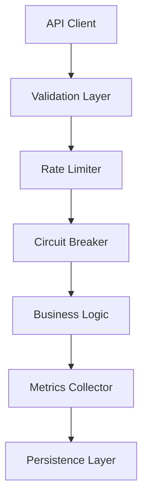
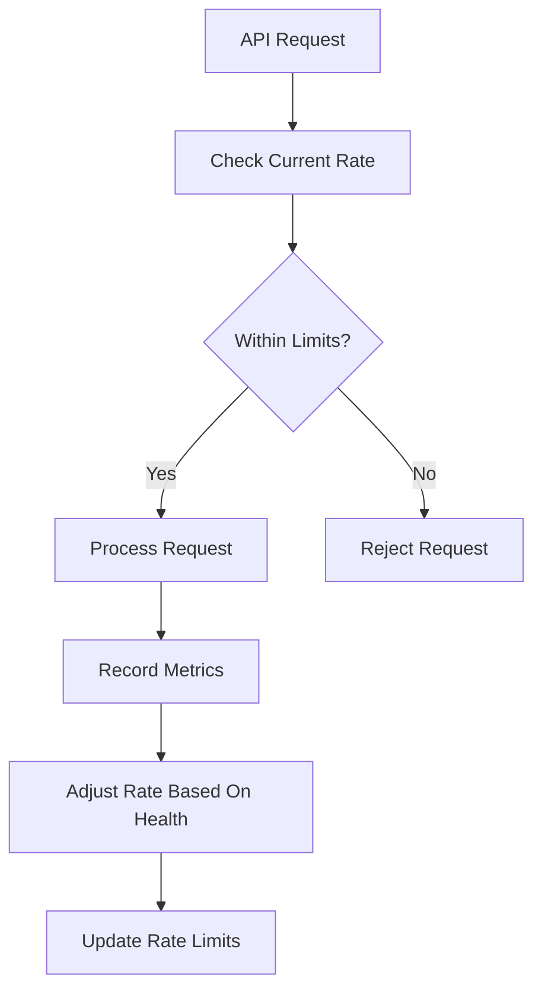
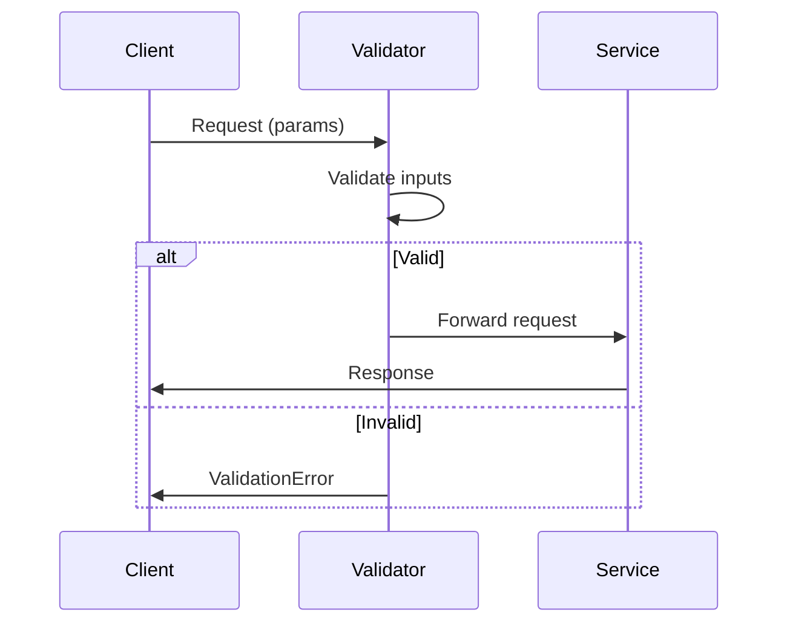
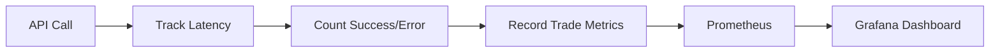
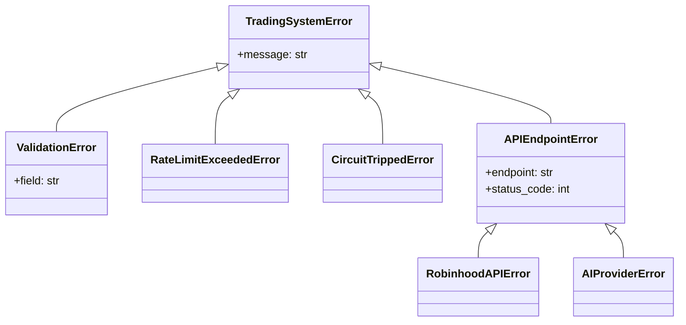

# Trading System Architecture v2.1

## Core Components



## Dynamic Rate Limiting



Key Features:
- **Dynamic Adjustment**: Rates adjust between 50-150% of baseline based on system health
- **Health Factors**:
  - Error rates (weight: 40%)
  - Latency percentiles (weight: 30%)
  - Resource utilization (weight: 30%)
- **Backoff Strategy**: Exponential backoff during degraded performance
- **Monitoring**: Integrated with Prometheus/Grafana

Configuration:
```yaml
rate_limits:
  robinhood:
    base_calls: 60
    period: 60s
    min_calls: 30 # 50% of base
    max_calls: 90 # 150% of base
  ai_service:
    base_calls: 30
    period: 60s
    min_calls: 15
    max_calls: 45
```

## Validation Flow



## Metrics Collection



## Error Handling Hierarchy



## Updated Component Diagram

```mermaid
graph LR
    subgraph Core Services
        A[Validation] --> B[Rate Limiting]
        B --> C[Circuit Breaking]
        C --> D[Metrics]
    end
    
    subgraph External Dependencies
        E[Robinhood API]
        F[AI Services]
    end
    
    D --> G[(Database)]
    D --> H[(Cache)]
    
    style A fill:#cff,stroke:#333
    style D fill:#cfc,stroke:#333