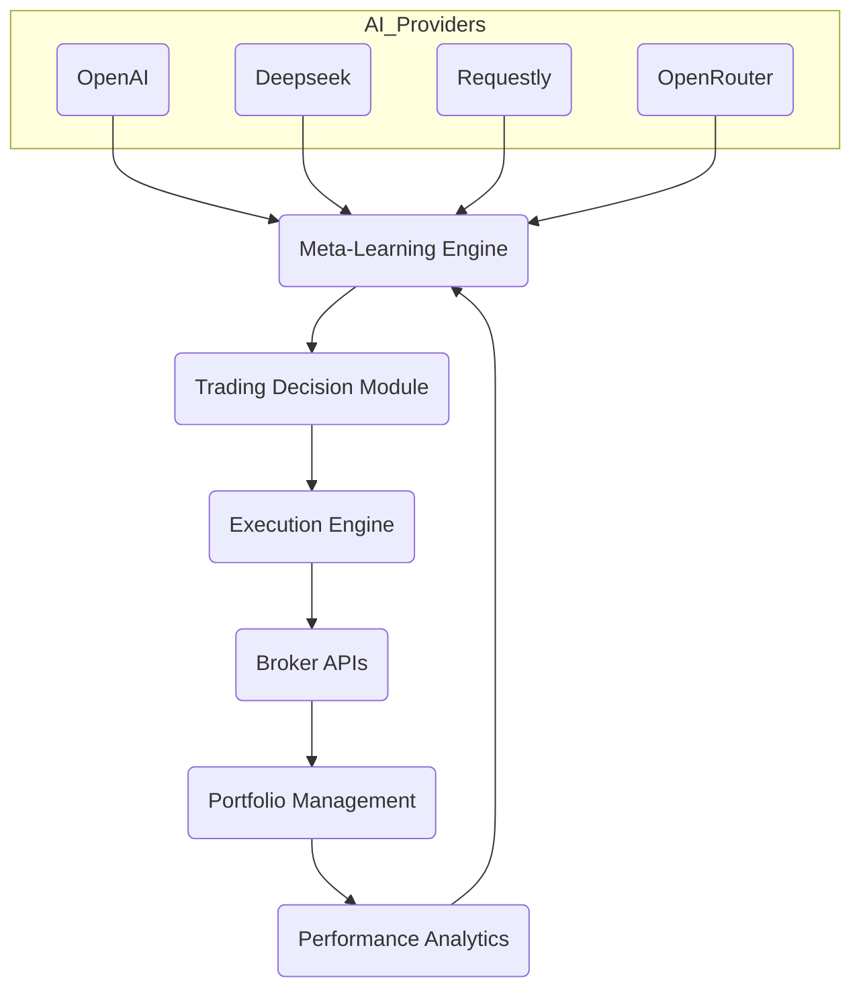

# Elite AI Trading Bot - Multi-Broker, Multi-Model, Fully Autonomous

---

## 🚀 Overview

Elite AI Trading Bot is a **cutting-edge, fully autonomous trading system** designed to integrate **multiple AI providers** with **multi-broker support** (Robinhood, Gemini, TDAmeritrade).  
It features **adaptive learning**, **modular architecture**, and **robust risk management** to deliver **scalable, maintainable, and high-performance** algorithmic trading.

---

## 🧠 Core Features

- **Multi-Provider AI Integration:** OpenAI, Deepseek, Requestly, OpenRouter, Anthropic, and more.
- **Adaptive Meta-Learning:** Continuously optimizes strategies based on market feedback.
- **Modular Architecture:** Clean separation of data ingestion, feature engineering, model training, execution, and risk management.
- **Memory Bank System:** Persistent project knowledge base for context-aware development.
- **Automated Backtesting:** Historical data simulation with configurable parameters.
- **Robust Risk Management:** Position sizing, stop-loss, portfolio diversification.
- **Cross-Platform Setup:** Easy install via `requirements.txt`, `environment.yml`, and CLI scripts.
- **CI/CD Ready:** Integrated testing, linting, formatting, and deployment automation.
- **Multi-API Broker Support:** Robinhood, Gemini, TDAmeritrade, extendable to others.
- **Error Handling & Retry Logic:** Resilient to API failures and rate limits.
- **Caching & Performance Optimization:** Smart caching, async calls, and efficient data pipelines.

---

## 🏗️ System Architecture



---

## 🔄 How It Works

1. **Data Ingestion:** Fetches and preprocesses real-time and historical market data.
2. **Feature Engineering:** Transforms raw data into actionable features.
3. **Meta-Learning:** Selects and tunes AI models dynamically based on performance.
4. **Trading Decision:** Generates buy/sell signals using ensemble AI outputs.
5. **Execution:** Places orders via broker APIs with error handling and retries.
6. **Risk Management:** Enforces portfolio constraints and stop-loss rules.
7. **Feedback Loop:** Analyzes results to refine models and strategies.

---

## 🗃️ Memory Bank System

- **productContext.md:** Project goals and scope.  
- **activeContext.md:** Current focus and status.  
- **systemPatterns.md:** Architectural patterns and best practices.  
- **decisionLog.md:** Key decisions and rationales.  
- **progress.md:** Task tracking and milestones.

---

## ⚙️ Setup Instructions

1. **Clone the repo:**

```bash
git clone https://github.com/yourusername/elite-ai-trading-bot.git
cd elite-ai-trading-bot
```

2. **Configure API keys in `.env`:**

```bash
OPENAI_API_KEY=your_openai_key
DEEPSEEK_API_KEY=your_deepseek_key
ROUTER_API_KEY=your_requestly_key
OPENROUTER_API_KEY=your_openrouter_key
```

3. **Install dependencies:**

```bash
pip install -r requirements.txt
# or
conda env create -f environment.yml
```

4. **Run training/backtesting:**

```bash
python scripts/train_and_backtest_all.py
```

5. **Start trading:**

```bash
python main.py
```

---

## 🧪 Testing & Quality

- **Unit & Integration Tests:** Located in `/tests`
- **Linting:** `flake8`, `pylint`
- **Formatting:** `black`
- **Coverage:** `pytest --cov`
- **CI/CD:** GitHub Actions ready

---

## 🤝 Contributing

- Fork the repo and create feature branches.
- Follow PEP8 and project style guides.
- Update tests and documentation.
- Submit pull requests with detailed descriptions.

---

## 📜 License

MIT License © 2025 Elite AI Trading Team

---

## 🌟 Acknowledgements

- OpenAI, Deepseek, Anthropic, OpenRouter  
- Robinhood, Gemini, TDAmeritrade APIs  
- Contributors and the open-source community

---

_Last updated: 2025-04-06_