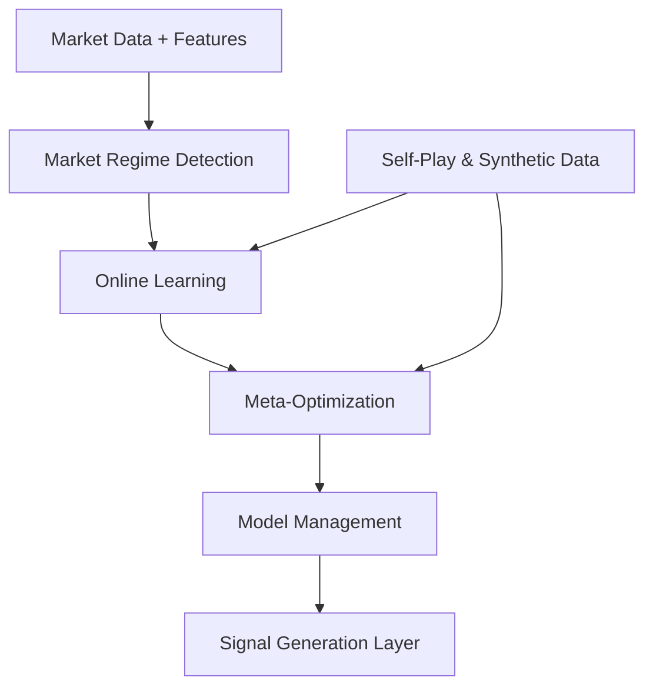

# Adaptive Learning & Meta-Optimization Layer Architecture

---

## Purpose

Enable the AI trading system to adapt, self-tune, and improve over time using continual learning, meta-learning, and adversarial robustness techniques.

---

## Components

### Market Regime Detection

- Hidden Markov Models (HMM), Gaussian Mixture Models (GMM), clustering
- Detects trending, mean-reverting, volatile regimes
- Routes signals and adjusts parameters dynamically

### Online Learning Module

- Experience replay buffers
- Incremental model updates
- Avoids catastrophic forgetting
- Adapts to recent data without losing past knowledge

### Meta-Optimization Engine

- Meta-Reinforcement Learning (Meta-RL)
- Bayesian hyperparameter optimization (Optuna, Ray Tune)
- Evolutionary algorithms (genetic search)
- Tunes hyperparameters, architectures, and strategies

### Self-Play & Adversarial Training

- Simulates adversarial market scenarios
- Uses GANs and synthetic data to expose models to rare events
- Improves robustness and generalization

### Model Management & Versioning

- Tracks model versions, training data, parameters
- Supports rollback and safe deployment
- Automates model selection based on validation metrics

---

## Data Flow

---

## Technologies

- PyTorch, TensorFlow
- Optuna, Ray Tune, DEAP
- Avalanche (continual learning)
- MLflow, DVC (versioning)
- GANs for synthetic data

---

## Interfaces

- Inputs: Historical and real-time data, model performance metrics
- Outputs: Updated models, optimized hyperparameters, regime labels
- APIs: Python classes, REST endpoints

---

## Notes

- Designed for continual, automated improvement
- Modular to allow new algorithms
- Logs all updates and decisions for auditability

---

*Document created on 2025-04-04 05:19:02 by Roo Architect.*