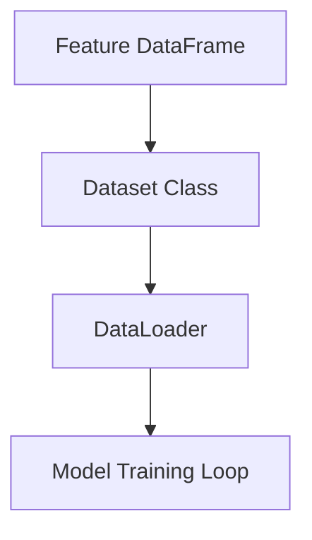
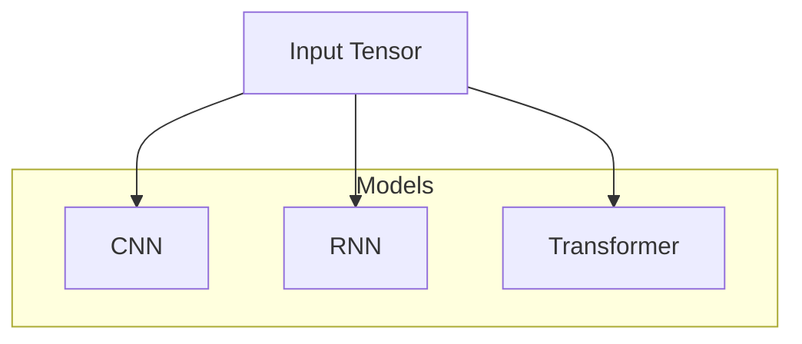
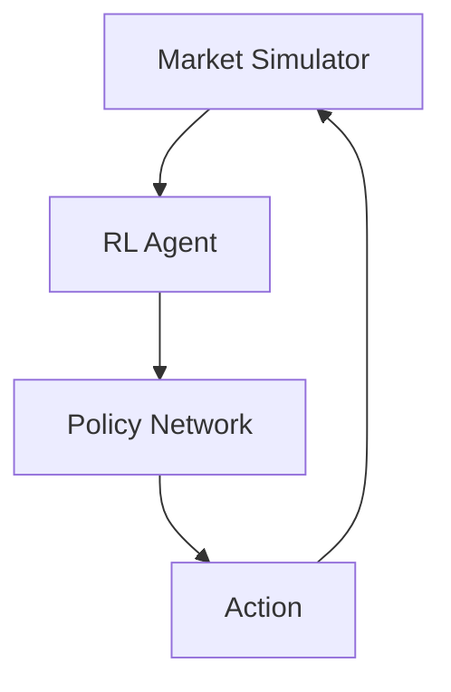
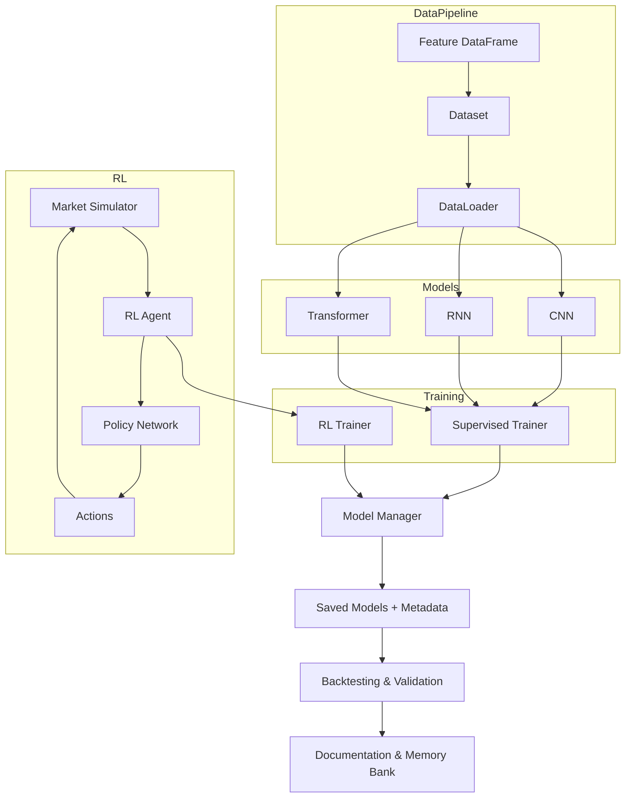

# AI Model Architecture Design

_Last updated: 2025-04-06 03:28_

---

## 1. Data Pipeline Layer

### Modules:
- `src/ai_trading_framework/datasets.py`
- `src/ai_trading_framework/dataloaders.py`

### Responsibilities:
- Load feature-engineered DataFrames (from CSV, Parquet, DB, or in-memory).
- Convert to PyTorch tensors.
- Implement `Dataset` classes:
  - **SupervisedDataset** (for DL models)
  - **RLDataset** (for RL state inputs)
- Implement `DataLoader` wrappers:
  - Batching
  - Shuffling
  - Augmentation (noise, dropout, mixup if relevant)

### Diagram:

---

## 2. Model Architectures Layer

### Modules:
- `src/ai_trading_framework/models/`
  - `cnn.py`
  - `rnn.py`
  - `transformer.py`
  - `ensemble.py` (optional stacking/blending)

### Responsibilities:
- Define modular, configurable PyTorch models:
  - CNN for pattern detection
  - RNN (LSTM/GRU) for sequences
  - Transformer for multi-modal data
- Support flexible input dimensions
- Enable easy architecture swapping

### Diagram:

---

## 3. Reinforcement Learning Layer

### Modules:
- `src/ai_trading_framework/rl_agents/`
  - `ppo.py`
  - `a3c.py`
  - `env_wrappers.py`

### Responsibilities:
- Implement PPO, A3C agents
- Integrate with market simulators
- Define observation/state spaces (using engineered features)
- Reward shaping, exploration strategies
- Support training and inference modes

### Diagram:

---

## 4. Training & Experimentation Layer

### Modules:
- `src/ai_trading_framework/trainers/`
  - `supervised_trainer.py`
  - `rl_trainer.py`
- `scripts/train_supervised.py`
- `scripts/train_rl.py`

### Responsibilities:
- Manage training loops
- Handle checkpointing, early stopping
- Log metrics (TensorBoard, W&B)
- Support hyperparameter sweeps
- Multi-GPU support (if feasible)

---

## 5. Model Management Layer

### Modules:
- `src/ai_trading_framework/model_manager.py`
- `src/ai_trading_framework/experiments.py`

### Responsibilities:
- Save/load models with versioning
- Track hyperparameters and metrics
- Prepare for online/meta-learning integration
- Organize experiment metadata

---

## 6. Testing & Validation Layer

### Modules:
- `tests/test_data_pipeline.py`
- `tests/test_models.py`
- `tests/test_rl_agents.py`
- `tests/test_trainers.py`
- `tests/backtesting/`

### Responsibilities:
- Unit tests for all modules
- Integration tests for data → model → output
- Backtesting with historical data
- Cross-validation, walk-forward analysis
- Performance benchmarking

---

## 7. Documentation & Memory Bank Layer

### Artifacts:
- Architecture diagrams (Mermaid, UML)
- Model/config documentation
- Experiment logs
- Design decisions (Memory Bank updates)
- Testing results

---

## Summary Diagram

---

## Design Principles

- **Modularity:** Swap models, datasets, trainers easily.
- **Extensibility:** Add new models, RL agents, features.
- **Reproducibility:** Track configs, seeds, data versions.
- **Testability:** Unit + integration tests throughout.
- **Continuous Documentation:** Update Memory Bank at each milestone.

---