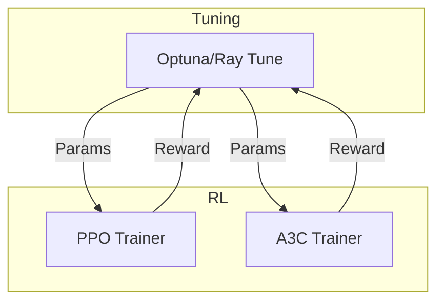
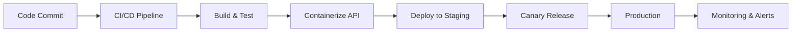

# AI Model Optimization & Deployment — Phase 2 Plan

---

## 1. RL Training with Hyperparameter Tuning

- Extend tuning integration to RL agents (`ppo.py`, `a3c.py`)
- Define RL-specific search space:
  - Learning rate
  - Discount factor (gamma)
  - Entropy coefficient
  - Clip ratio
  - GAE lambda
- Implement RL objective functions:
  - Return average episodic reward
  - Or risk-adjusted metrics (Sharpe)

---

## 2. Scalable Distributed Tuning with Ray Tune

- Add `ray[tune]` to requirements
- Refactor tuning orchestration:
  - Support both Optuna and Ray Tune backends
  - Use Ray Tune's `Trainable` API
  - Enable distributed, parallel trials
- Monitor via Ray Dashboard
- Log results to Memory Bank

---

## 3. Comprehensive Backtesting & Validation

- Develop or extend backtesting engine:
  - Historical simulation
  - Walk-forward validation
  - Cross-validation by regime, asset, timeframe
- Metrics:
  - Sharpe, Sortino, max drawdown
  - Precision, recall, F1
  - PnL distribution
- Visualize results
- Document findings and rationale

---

## 4. Automated Deployment Pipeline

- Containerize inference APIs (FastAPI, gRPC)
- Automate with GitHub Actions:
  - Build, test, deploy
  - Canary/staged rollout
- Add monitoring:
  - Latency
  - Drift detection
  - Failover triggers

---

## 5. Memory Bank & Version Control

- Update Memory Bank files:
  - Tuning configs/results
  - Validation outcomes
  - Deployment status
  - Open questions
- Frequent, atomic commits
- Branching for features
- Pull requests with detailed descriptions

---

## 6. Architecture & Workflow Diagrams

### Tuning & Training Flow

### Deployment Pipeline

---

## Next Steps

- User review
- Switch to Code mode for implementation
- Continuous updates and commits