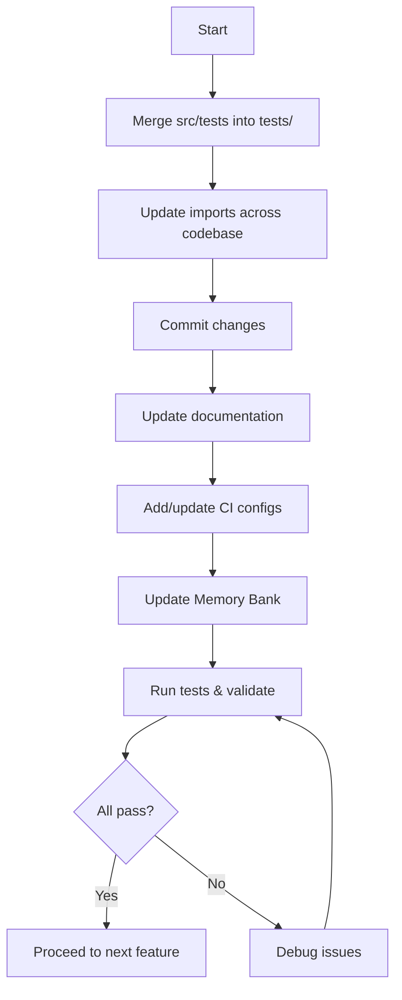

# Modular Refactoring — Expanded Autonomous Plan  
*Date: 2025-04-06 07:24 (London)*

---

## Overview

This plan details the autonomous modular refactoring process, including test reorganization, import updates, CI improvements, and Memory Bank updates.

---

## Detailed Subtasks

### A. Test Reorganization

- Locate all tests in `src/tests/`
- Move to root `tests/`
- Update relative imports inside tests
- Remove/archive empty `src/tests/`
- Commit: `"Refactor: Merged src/tests into tests/"`

---

### B. Update Imports

- Search codebase for `src.tests` or `src/tests`
- Update to new paths relative to `tests/`
- Verify in `conftest.py`, integration tests, helpers
- Commit: `"Chore: Updated imports after test merge"`

---

### C. Improve Documentation & Interfaces

- Update README and Memory Bank docs
- Document new test structure
- Update architecture diagrams if needed
- Commit: `"Docs: Updated test structure documentation"`

---

### D. Add Tooling, Automation, CI

- Add/update CI workflow configs
- Add Makefile/scripts for tests, linting, docs
- Commit: `"Chore: Added/updated CI and automation scripts"`

---

### E. Update Memory Bank

- Log decisions in `decisionLog.md`
- Update `activeContext.md`
- Append to `progress.md`
- Update `systemPatterns.md` if needed

---

## Architectural Notes

- **Dependencies:**  
  Test merge → Import updates → CI updates → Docs updates

- **Risks:**  
  Missed imports, CI failures, lost tests

- **Mitigations:**  
  Regex search, incremental commits, frequent test runs

---

## Workflow Diagram

---

## Next Step

Switch to **Code mode** to implement this plan autonomously.