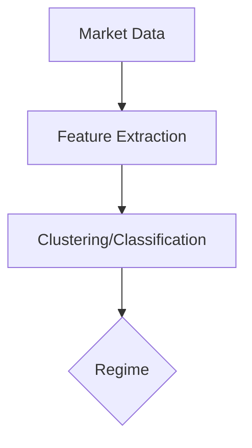

# Core AI Trading Framework - Expanded Design

## 1. Adaptive Learning Module

### Regime Detection

- Input: Market data (price, volume, volatility indicators).
- Approach:
  - Feature extraction: rolling returns, volatility, volume spikes.
  - Clustering (KMeans, GMM) or classification (Random Forest, SVM).
  - Label regimes: Bull, Bear, Sideways, Volatile.
- Output: Regime label string.

---

### Online Learning Update

- Use models supporting partial_fit (SGDClassifier, incremental XGBoost).
- Update with new data batches.
- Maintain stability with learning rate decay or regularization.

---

### Meta-Optimization

- Hyperparameter tuning during training.
- Use Bayesian Optimization (Optuna) or Evolutionary Algorithms.
- Objective: maximize reward, Sharpe ratio, or minimize drawdown.

---

### Adversarial Data Generation & Training

- Generate perturbed market scenarios (noise, shocks).
- Use FGSM or PGD on input features.
- Retrain models to improve robustness.

---

### Model Save/Load/Selection

- Save models with metadata.
- Load latest or best-performing model.
- Select model based on current regime or recent performance.

---

## 2. Risk Manager Module

### Kelly Sizing with Adjustments

- Calculate expected return and variance.
- Kelly formula: f* = (bp - q)/b.
- Adjust for risk tolerance (fractional Kelly).

---

### ATR + RL-based Stop Optimization

- Compute ATR for volatility-based stops.
- Use RL (Q-learning, DQN) to optimize stop/take levels.

---

### Monte Carlo Simulation

- Simulate thousands of price paths.
- Estimate distribution of returns and risk metrics.

---

### CVaR Calculation

- Calculate CVaR at desired confidence level.
- Average of worst-case losses beyond VaR.

---

### Portfolio Risk Aggregation

- Aggregate individual asset risks.
- Use covariance matrix for overall portfolio risk.

---

## 3. Execution Engine Module

### Kelly Sizing + Liquidity Adjustment

- Adjust Kelly size based on liquidity.
- Cap position size to avoid market impact.

---

### Adaptive Order Type Selection

- Choose order type based on volatility, urgency, liquidity.
- Use limit, market, iceberg, or TWAP orders accordingly.

---

### Order Placement via API

- Integrate with broker APIs.
- Handle authentication, retries, error handling.
- Confirm order status and execution.