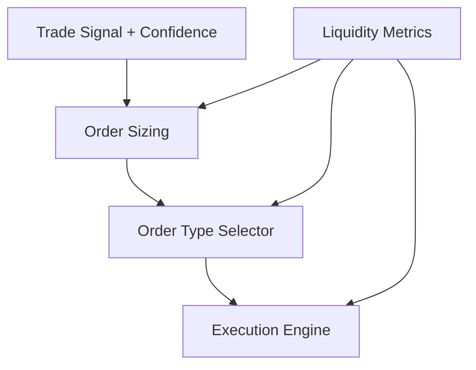

# Execution Optimization Layer Architecture

---

## Purpose

Convert trade signals into efficient, adaptive, low-slippage orders by dynamically adjusting order types, sizes, and timing based on real-time liquidity and microstructure.

---

## Components

### Order Sizing Module

- Inputs: Signal confidence, Kelly Criterion, volatility, liquidity metrics (VPIN, microprice)
- Outputs: Optimal position size, max order slice size
- Notes: Dynamically adapts to market conditions

### Order Type Selector

- Switches between TWAP, VWAP, market, limit, iceberg orders
- Inputs: Real-time order book, slippage history, latency constraints
- Logic: Minimize slippage while achieving execution goals

### Liquidity & Microstructure Analyzer

- Computes VPIN, microprice, order book imbalance
- Detects liquidity imbalances
- Adjusts order timing and sizing accordingly

### Execution Engine

- Places, modifies, cancels orders
- Monitors fills, adjusts strategy in real-time
- Technologies: CCXT, exchange APIs, async event loop

---

## Data Flow

---

## Algorithms & Techniques

- Kelly Criterion for dynamic sizing
- Adaptive switching of order types based on liquidity
- Iceberg orders for large trades
- Latency minimization via async and compiled code (Rust/C++)

---

## Interfaces

- Inputs: Trade signals, market microstructure data
- Outputs: Executed orders, fill reports, execution stats
- APIs: Python classes, REST endpoints

---

## Notes

- Designed for sub-second latency where feasible
- Modular to allow upgrades or exchange-specific customizations
- Logs all executions for analysis and compliance

---

*Document created on 2025-04-04 05:18:21 by Roo Architect.*