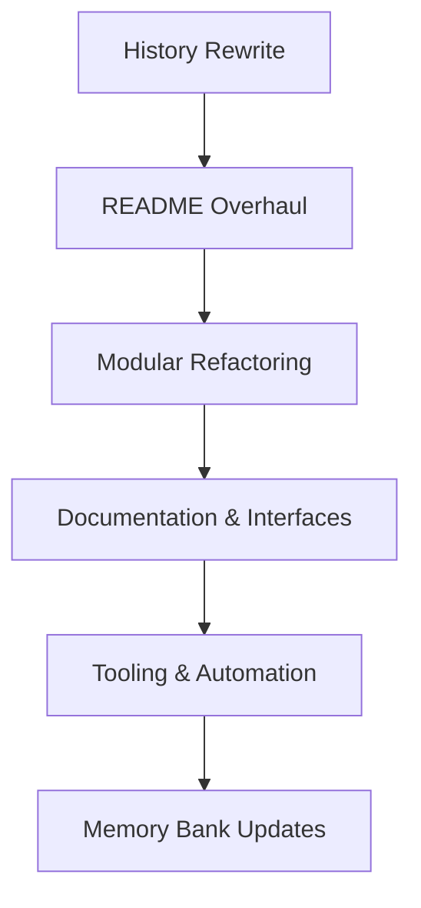

# Expanded Cleanup, Refactoring & Documentation Plan

_Last updated: 2025-04-06_

---

## 1. Purge Large Files from Git History

**Reason:** GitHub blocks pushes due to large binaries in history.

**Steps:**

1. Backup your repo (optional).
2. Run:

```bash
git filter-repo --path .venv/lib/python3.10/site-packages/pyarrow/libarrow.1900.dylib --path .venv/lib/python3.10/site-packages/torch/lib/libtorch_cpu.dylib --invert-paths
git push --force
```

3. Notify collaborators to re-clone/reset.

---

## 2. Replace README.md with Overhaul Draft

- Use the saved `memory-bank/README_overhaul_draft.md`.
- Commit: `"Docs: overhaul README with new architecture and features"`
- Push.

---

## 3. Modular Refactoring

- Organize code into:

```
src/ai_trading_framework/
├── models/
├── data/
├── training/
├── execution/
├── utils/
scripts/
tests/
memory-bank/
```

- Update imports.
- Commit: `"Refactor: modularize project structure"`
- Push.

---

## 4. Documentation & Interfaces

- Add docstrings and expand Markdown docs.
- Update architecture diagrams.
- Commit: `"Docs: improve documentation and interfaces"`
- Push.

---

## 5. Tooling, Automation, Testing

- Verify `requirements.txt` and `environment.yml`.
- Add Makefile or CLI scripts.
- Setup linting, formatting, CI.
- Commit: `"Chore: add environment setup, automation scripts"`
- Push.

---

## 6. Memory Bank Updates

- Log major decisions and progress.
- Timestamp all entries.
- Sync regularly.

---

## Mermaid Diagram



---

## Additional Notes

- `.zprofile` and `.zshrc` errors are shell warnings about missing `/Users/byteme/.wasmedge/env`.  
  Fix by commenting out or removing those `source` lines.

- After history purge, pushes should succeed.

- Proceed with batches sequentially, committing and pushing after each.