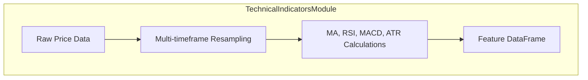

# Modular Feature Engineering Pipeline Design

*Date: 2025-04-06 03:24:27 (Europe/London)*

---

## 1. Technical Indicators Module

- **Purpose:** Compute multi-timeframe MA, RSI, MACD, ATR.
- **Approach:**
  - Use pandas resampling for multiple timeframes.
  - Calculate:
    - Moving Averages (Simple & Exponential)
    - RSI
    - MACD (fast EMA, slow EMA, signal line)
    - ATR
- **Diagram:**

---

## 2. Correlation Features Module

- **Purpose:** Cross-asset correlations.
- **Approach:**
  - Compute rolling Pearson/Spearman correlations.
  - Include major indices, sector ETFs, related assets.
  - Optionally lagged correlations.

---

## 3. Sentiment & Event Features Module

- **Purpose:** Integrate alternative data.
- **Approach:**
  - Merge NLP-derived sentiment scores.
  - Encode events as binary/categorical features.
  - Handle missing data via forward/zero fill.

---

## 4. Volatility & Liquidity Module

- **Purpose:** Quantify market conditions.
- **Approach:**
  - Historical volatility (std dev of returns)
  - ATR reuse
  - Liquidity metrics: bid-ask spread, volume ratios, VWAP deviations.

---

## 5. Feature Selection & Transformation

- **Purpose:** Improve model efficiency.
- **Approach:**
  - Normalize/scale features.
  - Dimensionality reduction (PCA, autoencoders).
  - Feature importance (SHAP, permutation).
  - Adaptive pruning based on importance.

---

## 6. Validation & Quality Assurance

- **Purpose:** Ensure feature integrity.
- **Approach:**
  - Stationarity tests (ADF, KPSS).
  - Leakage detection (correlation with future labels).
  - Outlier handling (winsorization, clipping).
  - Drift monitoring (PSI, KS test).

---

## 7. Testing Strategy

- **Unit Tests:** Module-level correctness.
- **Integration Tests:** Pipeline with synthetic data.
- **Synthetic Data Tests:** Inject known patterns, verify detection.

---

## 8. Documentation & Memory Bank

- **Documentation:**
  - Docstrings
  - Architecture diagrams
  - Feature definitions
- **Memory Bank:**
  - Log design decisions
  - Record feature selection rationale
  - Track validation results

---

## 9. Implementation Phases

| Phase | Focus | Deliverables |
|--------|------------------------------|------------------------------|
| 1 | TechnicalIndicatorsModule | MA, RSI, MACD, ATR calculations |
| 2 | CorrelationFeaturesModule | Cross-asset correlations |
| 3 | Sentiment & Event Module | Sentiment/event feature integration |
| 4 | Volatility & Liquidity Module | Volatility & liquidity metrics |
| 5 | FeatureSelector | Scaling, PCA, importance ranking |
| 6 | FeatureValidator | Validation routines |
| 7 | Testing | Unit & integration tests |
| 8 | Documentation & Memory Bank | Docs, diagrams, logs |

---

## Summary

This design ensures a **modular, extensible, and testable** feature engineering pipeline supporting multi-source data, iterative improvement, and rigorous validation.