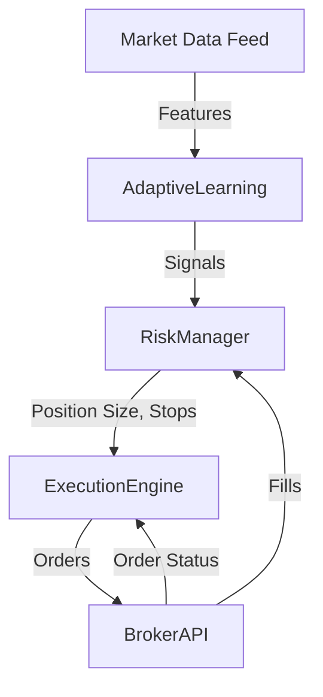

# Integration, Testing, and Deployment Plan

## 1. System Integration Architecture

---

## 2. API Wiring & Data Flow

- Market Data ingested, preprocessed into features.
- AdaptiveLearning outputs signals, confidence, volatility.
- RiskManager calculates sizing, stops.
- ExecutionEngine computes order size, selects order type, places orders.
- BrokerAPI returns fills and order status.
- RiskManager updates portfolio with fills.

---

## 3. Error Handling Strategy

- **AdaptiveLearning:** catch model errors, fallback to conservative signals.
- **RiskManager:** validate inputs, cap exposures, handle missing data.
- **ExecutionEngine:** retry failed orders, fallback to market orders.
- **BrokerAPI:** handle API errors, rate limits, auth failures.
- **Logging:** log all errors, alert on critical failures.

---

## 4. Testing Plan

- **Unit Tests:**  
  AdaptiveLearning, RiskManager, ExecutionEngine components.

- **Integration Tests:**  
  Signal → Risk → Execution flow, API mocks.

- **Backtesting:**  
  Historical data replay, validate PnL, drawdowns.

- **Stress Testing:**  
  High-frequency signals, API failures.

---

## 5. Deployment Plan (No Docker)

- Use **virtualenv** or **conda** for environment isolation.
- Use **environment variables** for secrets.
- Separate **dev/staging/prod configs**.
- Implement **monitoring and alerts**.
- Use **CI/CD pipelines** (GitHub Actions, etc.) for tests and deploys.
- Package as **Python modules/scripts** runnable via CLI or scheduler.

---

## 6. Next Steps

- **Acquire crypto trading data (1-12 months).**
- **Run implemented logic on dataset.**
- **Analyze results, refine models.**
- **Use insights as foundational learning data.**