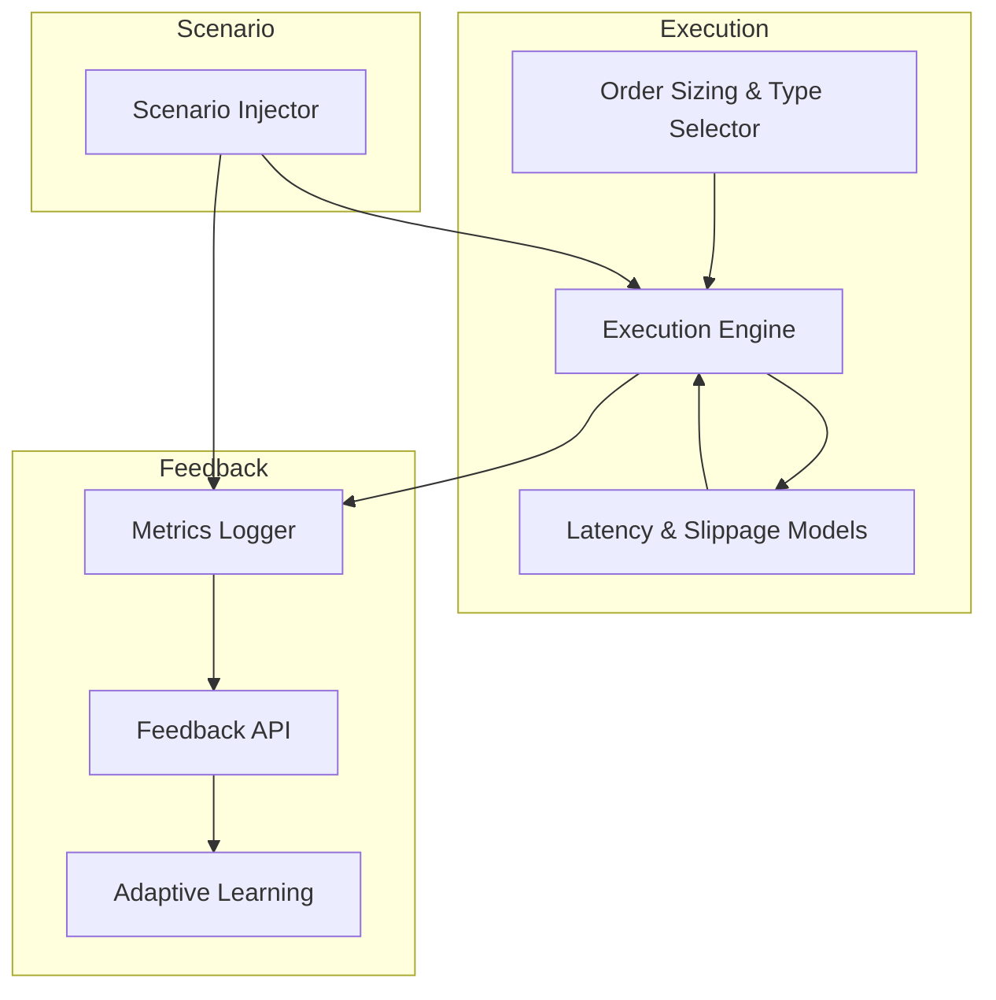

# Robust, Configurable Execution Modeling & Feedback Architecture  
*Drafted 2025-04-06 10:59:33*

---

## 1. Overview

Design a modular, scalable architecture enabling:

- Configurable stochastic/historical **latency & slippage models** (global + per-asset)
- **Comprehensive JSON execution metrics logging** (per order, real-time + post-trade)
- **Scenario injection framework** (scripted/randomized, deterministic replay)
- **Extensible feedback interface** compatible with adaptive learning
- Thorough documentation with rationales, alternatives, and diagrams

---

## 2. Latency & Slippage Modeling Framework

### Features
- **Model Types:**  
  - *Historical sampling* (empirical distributions)  
  - *Parametric stochastic models* (normal, lognormal, mixtures)  
  - *Agent-based/microstructure simulation* (optional future extension)

- **Configuration Scope:**  
  - **Global defaults**  
  - **Per-asset overrides**

- **Runtime Switching:**  
  - Select model type dynamically  
  - Adjust parameters on-the-fly

### Config Example (YAML/JSON)
```json
{
  "latency_model": {
    "global": {"type": "normal", "mean_ms": 50, "std_ms": 10},
    "per_asset": {"AAPL": {"type": "historical", "source": "latency_aapl.csv"}}
  },
  "slippage_model": {
    "global": {"type": "lognormal", "mu": 0, "sigma": 0.1},
    "per_asset": {"BTCUSD": {"type": "stochastic", "distribution": "mixture", "params": {...}}}
  }
}
```

---

## 3. Execution Metrics Logging

### Schema (per order fill)
```json
{
  "order_id": "...",
  "timestamp": "...",
  "asset": "...",
  "side": "buy/sell",
  "qty": ...,
  "intended_price": ...,
  "executed_price": ...,
  "latency_ms": ...,
  "slippage": ...,
  "model_params": {...},
  "scenario_id": "...",
  "extra_metrics": {...}
}
```

### Capabilities
- **Real-time aggregation:** latency, slippage, fill rates  
- **Post-trade analysis:** distribution fitting, outlier detection  
- **Storage:** JSONL files, database, or message queue

---

## 4. Scenario Injection & Replay Framework

### Features
- **Scenario Types:**  
  - *Scripted events* (e.g., news shocks, liquidity drops)  
  - *Randomized perturbations* (volatility spikes, latency bursts)  
  - *Hybrid*

- **Injection Points:**  
  - Market data feed  
  - Latency/slippage models  
  - Risk parameters

- **Deterministic Replay:**  
  - Scenario seeds saved with metadata  
  - Full reproducibility of runs

---

## 5. Modular Feedback Interface

### Features
- **Compatible with adaptive learning modules**  
- **Supports both push (webhook/event)** and **pull (REST API)**  
- **Payload:** JSON execution metrics, scenario metadata, model states  
- **Extensible:** add new metrics or feedback types easily

### Example Endpoints
- `POST /feedback/metrics`  
- `GET /feedback/metrics?since=...`  
- `POST /feedback/scenario_outcome`  

---

## 6. Integration Points



---

## 7. Design Rationales & Alternatives

### Latency/Slippage Modeling
- **Why both stochastic & historical?**  
  Flexibility: stochastic for controlled tests, historical for realism.

- **Alternative:**  
  Agent-based microstructure simulation (complex, deferred for future).

### Scenario Injection
- **Why deterministic replay?**  
  Enables debugging, fair benchmarking, and reproducibility.

- **Alternative:**  
  Purely randomized runs (less reproducible).

### Feedback Interface
- **Why REST + event-driven?**  
  Covers both batch analytics and real-time learning triggers.

- **Alternative:**  
  Message queues (future extension).

---

## 8. Next Steps

- User review & approval  
- Switch to **Code Mode** for implementation  
- Incremental integration with existing execution & learning modules  
- Develop test scenarios and validation suite

---

*End of Draft*