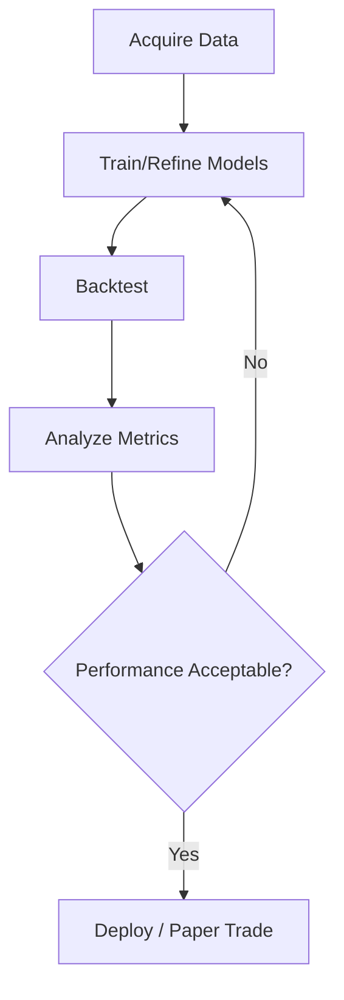

# Model Refinement & Backtesting Plan

## 1. Dataset Preparation

- Use `data/crypto/BTCUSDT_1d_enriched.csv`
- Features: returns, volatility, technical indicators
- Labels: future returns, regime classification

---

## 2. AdaptiveLearning Model Refinement

- Train regime detection
- Improve confidence scoring
- Incorporate adversarial training
- Use meta-optimization

---

## 3. RiskManager Refinement

- Calibrate Kelly sizing
- Adjust stop-loss/take-profit
- Validate CVaR and Monte Carlo
- Aggregate risks

---

## 4. Backtesting Framework

- Simulate trades with AI modules
- Track PnL, Sharpe, drawdown, win rate, risk-adjusted returns

---

## 5. Iterative Improvement Loop

---

## 6. Next Steps

- Implement feature engineering
- Train regime classifier
- Run backtests
- Refine models