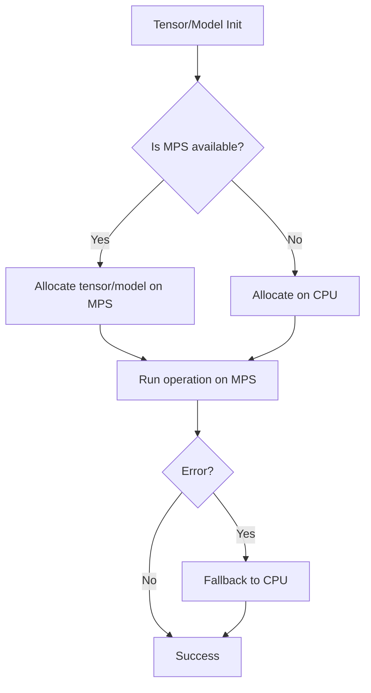

# Fix Plan: PyTorch MPS Placeholder Storage Error

## Problem
RuntimeError: Placeholder storage has not been allocated on MPS device

---

## Root Cause
- Moving **uninitialized or placeholder tensors** (e.g., from `torch.empty()`) to MPS without proper allocation.
- Lack of **explicit `.to("mps")`** device placement.
- MPS backend requires **safe, explicit tensor allocation**.

---

## Step-by-Step Fix Plan

### 1. **Identify All Tensor and Model Initializations**
- Search codebase for:
  - `torch.empty()`
  - `torch.tensor()`
  - Model instantiations
- Replace unsafe initializations.

### 2. **Replace Unsafe Tensor Creation**
- **Avoid**:
  ```python
  bad = torch.empty((shape)).to("mps")
  ```
- **Use**:
  ```python
  safe = torch.zeros((shape), device="mps")
  # or
  safe = torch.rand((shape), device="mps")
  ```

### 3. **Explicitly Move Models and Tensors to Device**
- Add device selection logic:
  ```python
  device = "mps" if torch.backends.mps.is_built() else "cpu"
  ```
- Move models:
  ```python
  model = model.to(device)
  ```
- Move tensors:
  ```python
  tensor = tensor.clone().detach().to(device)
  ```

### 4. **Add Debug Tracing**
- Print device info:
  ```python
  print(f"Using device: {device}")
  print(f"Tensor allocated on: {tensor.device}")
  ```

### 5. **Fallback for Unsupported Ops**
- Wrap unsupported operations:
  ```python
  if device == "mps":
      try:
          # MPS operation
      except RuntimeError:
          tensor = tensor.to("cpu")
          # CPU fallback
  ```

### 6. **Test on Apple Silicon**
- Validate all tensors/models are on `mps`.
- Confirm no placeholder errors occur.
- Benchmark for performance.

---

## Mermaid Diagram: Device Placement Flow



---

## Summary
- **Avoid** moving uninitialized tensors to MPS.
- **Explicitly allocate** tensors/models on correct device.
- **Add debug prints** for device tracing.
- **Fallback gracefully** for unsupported ops.

---

*Plan generated 2025-04-06 15:11 by Roo Architect.*