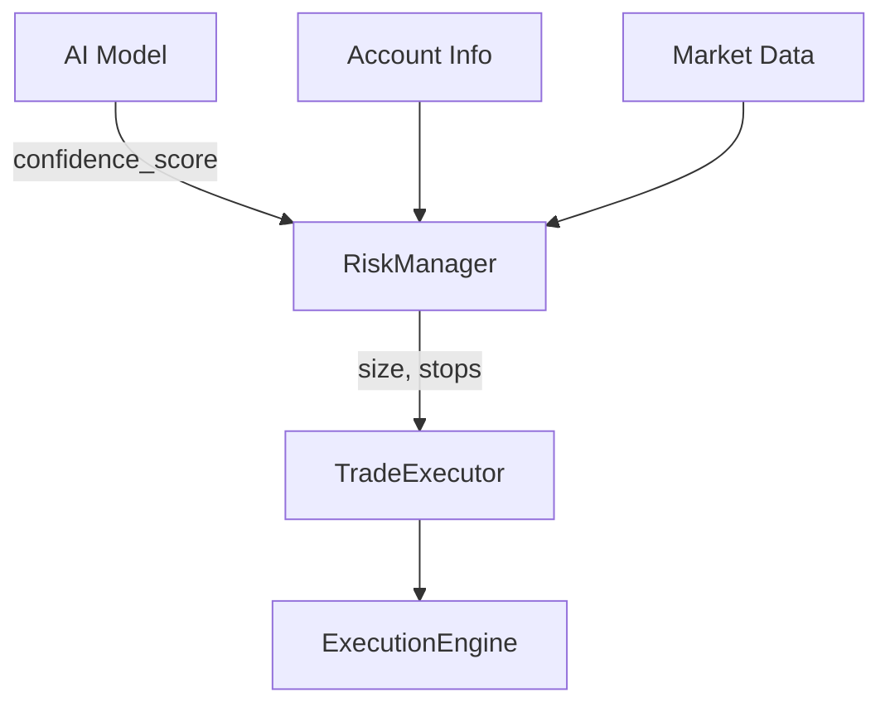
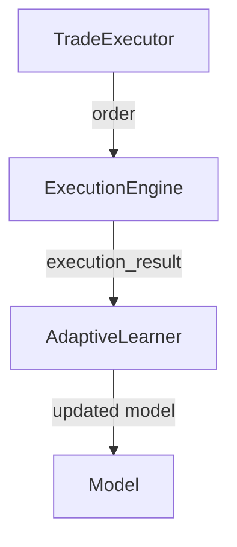
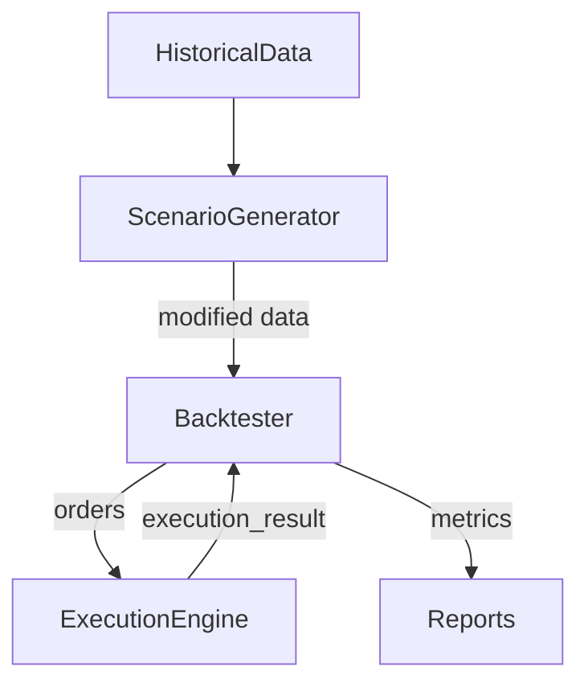

# Next Autonomous Enhancements - Detailed Architecture  
*Date: 2025-04-06*

---

## 1. Risk Management Integration

### Components:
- **RiskManager (in `risk_manager.py`)**
  - `calculate_position_size(confidence_score, account_balance, risk_tolerance) -> float`
  - `determine_adaptive_stops(entry_price, confidence_score, market_volatility) -> (stop_loss, take_profit)`
  - **Dependencies:** Model output (confidence), account info, market data

- **TradeExecutor**
  - Requests position size and stops from `RiskManager`
  - Passes order + risk params to `ExecutionEngine`

### Data Flow:

---

## 2. Execution Simulation and Feedback

### Components:
- **ExecutionEngine (in `execution_engine.py`)**
  - `simulate_execution(order, market_state) -> execution_result`
    - Adds latency, slippage
    - Returns executed price, fill status, latency
  - `record_execution_feedback(trade_id, execution_metrics)`
    - Stores slippage, latency, fill ratio
- **AdaptiveLearner**
  - Consumes execution feedback
  - Adjusts model parameters or confidence calibration

### Data Flow:

---

## 3. Backtesting with Scenario Injection

### Components:
- **Backtester (in `backtesting.py`)**
  - `run_backtest(strategy, scenario_config)`
    - Multi-asset, multi-period
    - Calls `ScenarioGenerator`
  - `track_metrics(performance_data, scenario_id)`
    - Sharpe, drawdown, win rate, execution quality
- **ScenarioGenerator**
  - `inject_shocks(data)`
  - `change_volatility_regime(data)`
  - `add_anomalies(data)`

### Data Flow:

---

## 4. Memory Bank & Documentation Updates

### Components:
- **Memory Bank Markdown Files**
  - `decisionLog.md` — architecture decisions
  - `progress.md` — task status
  - Architecture docs — updated diagrams, interfaces
- **Update Process**
  - After each module enhancement, append decisions and progress
  - Maintain traceability

---

## Summary of Integration Points

| Component            | Calls / Consumes                     | Provides To                     |
|----------------------|-------------------------------------|--------------------------------|
| AI Model             |                                     | RiskManager (confidence)       |
| RiskManager          | Model, Account, Market Data         | TradeExecutor                  |
| TradeExecutor        | RiskManager                         | ExecutionEngine                |
| ExecutionEngine      | TradeExecutor, Market Data          | AdaptiveLearner, Backtester    |
| AdaptiveLearner      | ExecutionEngine feedback            | AI Model                       |
| Backtester           | ScenarioGenerator, ExecutionEngine  | Reports                        |
| ScenarioGenerator    | Historical Data                     | Backtester                     |

---

## Next Step
- Review this architecture plan.
- Confirm or request changes.
- Upon approval, proceed to implementation phase.