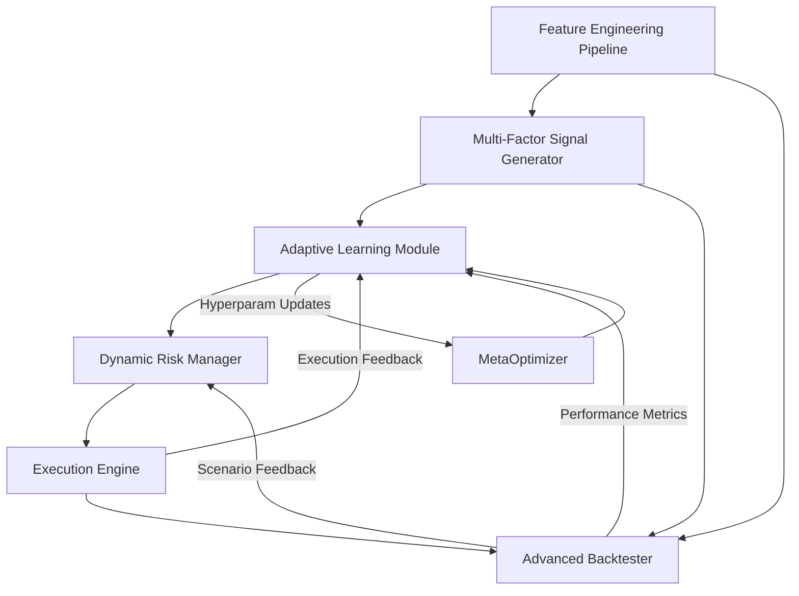

# Next Phase Adaptive AI Trading System Architecture (Expanded)

## Components Overview

### 1. Feature Engineering Pipeline
- Modular transformers (scaling, encoding, technical indicators)
- Outputs multi-factor features for signal generation

### 2. Multi-Factor Signal Generator
- Combines features into composite signals
- Uses adaptive thresholds, ensemble models

### 3. Adaptive Learning Module
- Incremental updates, meta-learning triggers
- Receives features and signals
- Outputs trade decisions with confidence scores

### 4. Dynamic Risk Manager
- Adjusts position sizing, stop-loss, take-profit
- Based on model confidence and market regime

### 5. Execution Engine
- Handles order routing, slippage simulation
- Provides execution feedback to learning module

### 6. Advanced Backtester
- Multi-period, multi-asset simulation
- Real-time feedback to adaptive module
- Supports scenario injection (shocks, regime shifts)

### 7. Testing & Validation
- Multi-scenario test cases
- Continuous integration with pytest
- Performance monitoring and alerts

### 8. Continuous Feedback Loops
- Execution quality → Adaptive Learning
- Backtest results → MetaOptimizer
- Risk events → Adaptive thresholds

---

## System Flow Diagram

---

## Next Steps
- Implement integration points per this architecture
- Develop continuous feedback mechanisms
- Expand multi-scenario testing
- Update documentation and Memory Bank continuously