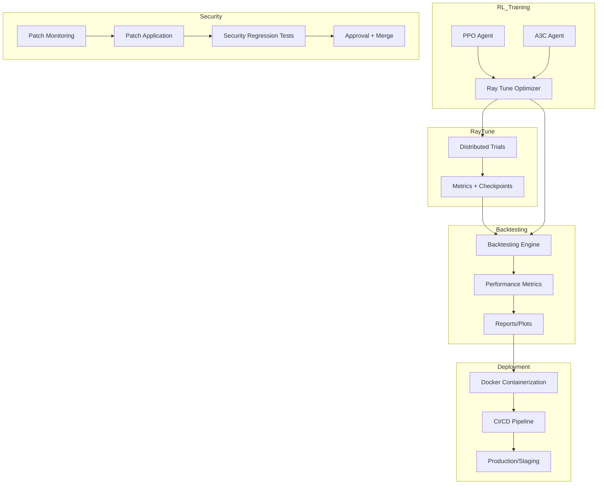

# Next Phase Architecture: RL Optimization, Backtesting, Deployment, Security

*Date: 2025-04-06 05:00 (UTC+1)*

---

## 1. High-Level Architecture Diagram

---

## 2. Module Responsibilities

### RL Agents (`src/ai_trading_framework/rl_agents/`)
- PPO, A3C implementations
- Expose trainable functions for Ray Tune

### Ray Tune Integration (`src/ai_trading_framework/trainers/`)
- Wrap RL agents as Ray Tune trainables
- Define hyperparameter search spaces
- Manage distributed tuning jobs
- Log metrics and checkpoints

### Backtesting (`src/ai_trading_framework/backtesting.py`)
- Standard API to evaluate trained policies
- Batch processing and metrics calculation
- Result storage and visualization

### Deployment (`docker-compose.yml`, CI configs)
- Containerize modules
- Automate build/test/deploy via GitHub Actions

### Security Automation (`scripts/`, CI)
- Monitor upstream patches
- Automate patch application/testing
- Document in Memory Bank

---

## 3. Mode Handoff Points

| Phase                        | Mode        | Output / Trigger                                   |
|------------------------------|-------------|----------------------------------------------------|
| Architecture Design          | Architect   | Detailed diagrams, specs (this doc)                |
| RL + Tune Implementation     | Code        | Ray Tune integration, trainable wrappers           |
| Backtesting Implementation   | Code        | Backtesting API, batch workflows                   |
| Deployment Automation        | Code        | Docker + CI/CD configs                             |
| Security Automation          | Code        | Patch scripts, CI integration                      |
| Testing                      | Test        | Unit + integration tests for all modules           |
| Debugging                    | Debug       | Fix integration/runtime issues                     |
| Documentation Updates        | Architect   | Memory Bank updates, onboarding docs               |

---

## 4. Next Actions

- **Code Mode:** Implement Ray Tune wrappers and distributed tuning.
- **Code Mode:** Build standardized backtesting workflows.
- **Code Mode:** Automate Docker builds and CI/CD pipelines.
- **Code Mode:** Integrate security patch automation.
- **Test Mode:** Develop test suites.
- **Debug Mode:** Monitor and fix issues.
- **Architect Mode:** Update documentation iteratively.

---

*End of Architecture Plan*