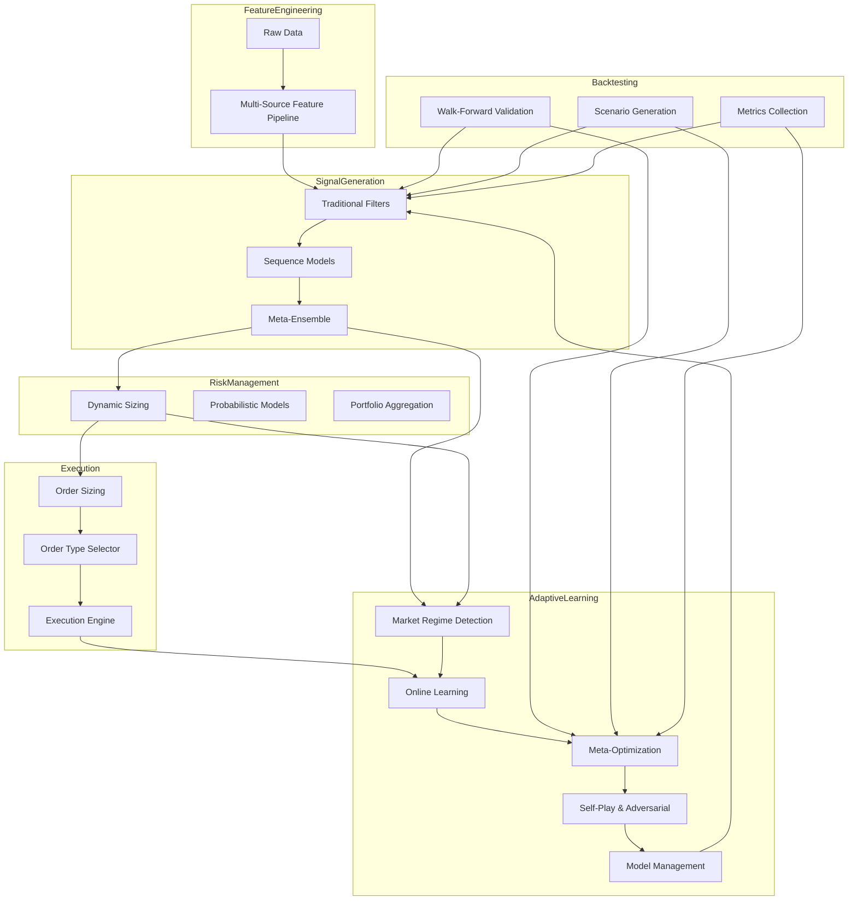

# Next-Phase Autonomous Implementation Cycle Plan  
*Date: 2025-04-06 07:32 (London)*

---

## 1. Overview

This plan orchestrates the **autonomous, modular, self-improving AI trading system** implementation cycle, alternating seamlessly between **Architect** and **Code** modes. It integrates adaptive learning, feature engineering, multi-factor signal generation, risk management, execution, advanced backtesting, and rigorous validation, with continuous Memory Bank updates.

---

## 2. Phased Implementation Roadmap

### Phase 1: Modular Adaptive Learning Components

- Implement **Market Regime Detection** module (HMM, GMM, clustering)
- Develop **Online Learning** with replay buffers
- Build **Meta-Optimization Engine** (Optuna, Ray Tune, evolutionary search)
- Integrate **Self-Play & Adversarial Training**
- Set up **Model Management & Versioning** (MLflow/DVC)
- Define **clear APIs** for each adaptive module
- **Mode:** Architect → Code

---

### Phase 2: Integration with Core Pipeline

- Connect adaptive modules to:
  - **Feature Engineering Pipeline**
  - **Signal Generation Engine**
  - **Risk Management Layer**
  - **Execution Optimization Layer**
- Implement **feedback loops**:
  - Performance metrics → adaptive learning
  - Regime detection → signal adjustments
- **Mode:** Architect → Code

---

### Phase 3: Advanced Backtesting & Real-Time Feedback

- Develop **walk-forward validation** with rolling windows
- Integrate **scenario generation** (Monte Carlo, stress tests)
- Collect **performance metrics** (Sharpe, Calmar, drawdown)
- Feed insights into **meta-optimization engine**
- **Mode:** Architect → Code

---

### Phase 4: Comprehensive Testing & Validation

- **Unit tests** for all adaptive and integration modules
- **Integration tests** across full pipeline
- **Synthetic data tests** with known patterns
- **Robustness tests** with adversarial scenarios
- **Mode:** Architect → Code → Test

---

### Phase 5: Documentation & Memory Bank Updates

- Update **architecture diagrams** with new modules
- Log **design decisions** in `decisionLog.md`
- Track **progress** in `progress.md`
- Document **APIs, data flows, validation results**
- **Mode:** Architect

---

## 3. Autonomous Mode Alternation Logic

| Step                           | Mode        | Trigger/Condition                          |
|--------------------------------|-------------|-------------------------------------------|
| Design adaptive modules        | Architect   | After requirements analysis               |
| Implement adaptive modules     | Code        | After design finalized                    |
| Integrate modules              | Code        | After module implementation               |
| Plan feedback loops            | Architect   | After integration                         |
| Implement feedback loops       | Code        | After design finalized                    |
| Develop backtesting            | Code        | After integration                         |
| Design validation protocols    | Architect   | After backtesting design                  |
| Implement tests                | Code/Test   | After validation plan                     |
| Update documentation           | Architect   | After each major milestone                |
| Repeat cycle                   | Architect↔Code | Until full system realization          |

---

## 4. System Architecture Diagram

---

## 5. Continuous Memory Bank & Documentation Updates

- **Decision Log:** Record all architectural and implementation decisions with timestamps
- **Progress:** Track milestones, completed phases, next steps
- **Product Context:** Update high-level goals and architecture as system evolves
- **System Patterns:** Document reusable patterns and best practices
- **Validation Results:** Archive test outcomes and rationale

---

## 6. Summary

This plan enables **uninterrupted, autonomous, modular implementation** of the adaptive AI trading system, with dynamic alternation between Architect and Code modes, continuous integration of feedback, and rigorous documentation for traceability.

---

*Generated by Roo Architect, 2025-04-06 07:32 (London)*