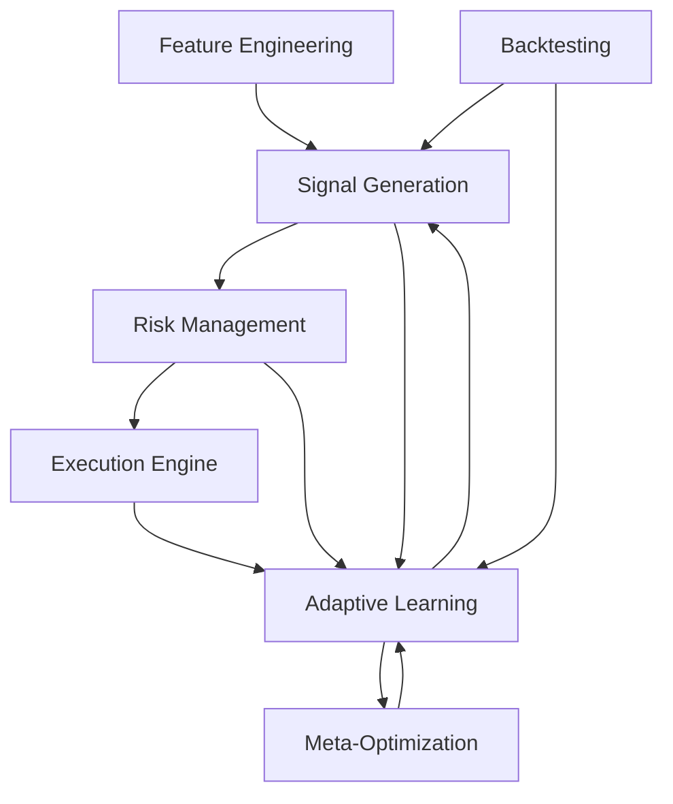

# Next Autonomous Phase: Adaptive Modular AI Trading System  
*Date: 2025-04-06 07:27 (London)*

---

## Objectives

- Modularize adaptive learning and meta-optimization layers
- Integrate with feature engineering and signal generation
- Enhance backtesting and feedback loops
- Expand test coverage
- Update documentation and Memory Bank

---

## Detailed Plan

### 1. Modularize Adaptive Learning Layer

- **Market Regime Detection** as standalone module
- **Online Learning** with experience replay buffers
- **Meta-Optimization Engine** (Optuna, Ray Tune, evolutionary)
- **Self-Play & Adversarial Training** module
- **Model Management & Versioning** with MLflow/DVC
- Define clear APIs for each component

---

### 2. Integrate with Core Pipeline

- Connect adaptive modules to:
  - Feature Store
  - Signal Generation
  - Risk Management
  - Execution Engine
- Implement feedback loops:
  - Performance metrics → Adaptive learning
  - Regime detection → Signal adjustments

---

### 3. Enhance Backtesting & Simulation

- Walk-forward validation with rolling windows
- Scenario generation (Monte Carlo, stress tests)
- Metrics collection (Sharpe, Calmar, drawdown)
- Feed insights into meta-optimization

---

### 4. Expand Testing & Validation

- **Unit tests** for each adaptive module
- **Integration tests** with data pipelines & signal engine
- **Synthetic data tests** with known patterns
- **Robustness tests** with adversarial scenarios

---

### 5. Documentation & Memory Bank

- Update architecture diagrams with new modules
- Log design decisions in `decisionLog.md`
- Track progress in `progress.md`
- Document APIs and data flows
- Record validation results and rationale

---

## Workflow Diagram

---

## Next Step

Switch to **Code mode** to implement this plan autonomously.