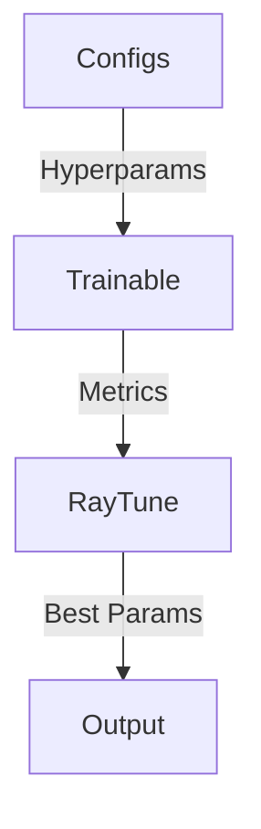
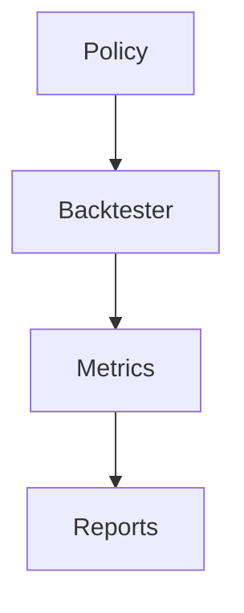
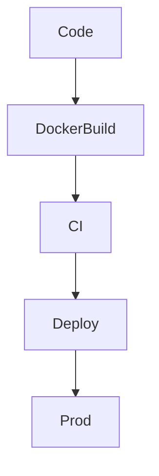
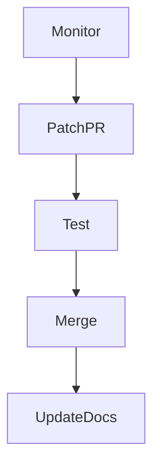

# Next Phase Implementation Plan: RL Optimization, Backtesting, Deployment, Security

*Date: 2025-04-06 05:03 (UTC+1)*

---

## 1. Ray Tune Integration

### Modules:
- `src/ai_trading_framework/trainers/ray_tune_trainer.py`
- `src/ai_trading_framework/rl_agents/ppo.py`
- `src/ai_trading_framework/rl_agents/a3c.py`

### Key Components:
- `PPOTrainable` and `A3CTrainable` classes inheriting from `ray.tune.Trainable`
- `get_search_space()` function defining hyperparameter grids
- `run_tuning()` function to launch Ray Tune experiments
- Logging to Ray dashboard + local files

### Data Flow:

### Testing:
- Unit tests for trainables
- Integration tests for tuning runs
- Mock Ray cluster for CI

---

## 2. Backtesting Workflows

### Modules:
- `src/ai_trading_framework/backtesting.py`
- `src/ai_trading_framework/data_ingestion.py`

### Key Components:
- `Backtester` class with `run_backtest(policy)` method
- Metrics calculation: Sharpe, Sortino, drawdown, turnover
- Batch runner for multiple policies/params
- Result storage (CSV, plots)

### Data Flow:

### Testing:
- Unit tests for metrics
- Integration tests with sample policies
- Regression tests on historical data

---

## 3. Deployment Automation

### Modules:
- `docker-compose.yml`
- `.github/workflows/ci.yml`
- `scripts/deploy.sh`

### Key Components:
- Dockerfiles for training, tuning, inference, backtesting
- GitHub Actions for build/test/deploy
- Rollback and canary deployment support

### Data Flow:

### Testing:
- CI pipeline tests
- Deployment smoke tests
- Rollback verification

---

## 4. Security Patching

### Modules:
- `scripts/patch_monitor.py`
- `.github/workflows/security.yml`

### Key Components:
- Script to monitor upstream repos for security patches
- Automated PR creation
- Regression + security tests before merge
- Documentation update in Memory Bank

### Data Flow:

### Testing:
- Patch detection tests
- Automated test suite on patch branches
- Manual review triggers

---

## 5. Next Steps

- Switch to **Code mode** to implement Ray Tune integration first.
- Develop backtesting workflows in parallel.
- Set up deployment automation scripts and CI/CD.
- Integrate security patch monitoring.
- Update Memory Bank continuously.

---

*End of Implementation Plan*