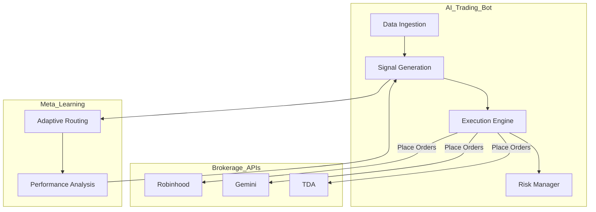

# AI Trading Bot Project — Next Steps Plan

## 1. Code Quality & Architecture

- Refactor `src/` modules for clarity:
  - Split `TradingBot` into smaller components (DataIngestion, SignalGeneration, Execution, RiskManagement)
  - Use interfaces/abstract base classes for pluggable AI agents
  - Add type hints & docstrings throughout
- Brokerage API Wrappers
  - Wrap `robin_stocks` calls with error handling, retries, and logging
  - Abstract brokerage layer to support multi-broker in future
- Configuration Management
  - Centralize configs (API keys, params) via `.env` or config files
  - Add validation & secrets management

## 2. Testing Strategy

- Unit Tests
  - Increase coverage on `src/` modules
  - Mock brokerage APIs and AI providers
- Integration Tests
  - Simulate end-to-end trade flow with mock data
  - Validate fallback logic and error handling
- Benchmarking
  - Profile latency of decision loop
  - Track API response times

## 3. Documentation

- Memory Bank
  - Update `productContext.md` with current architecture
  - Log recent decisions & rationale in `decisionLog.md`
  - Track open issues in `activeContext.md`
- Codebase
  - Add module-level docstrings
  - Generate API docs (e.g., with Sphinx)
- User Guide
  - How to configure, run, and extend the bot
  - Deployment instructions

## 4. Deployment Pipeline

- Containerization
  - Create/update Dockerfile
  - Use `docker-compose.yml` for multi-service setup (bot, database, monitoring)
- CI/CD
  - Add GitHub Actions or similar for:
    - Linting
    - Testing
    - Build & deploy
- Monitoring
  - Integrate Prometheus & Grafana dashboards
  - Alerting on failures or anomalies

## 5. Target Architecture (Mermaid Diagram)

## 6. Summary

- Modularize trading bot components
- Improve brokerage abstraction
- Enhance testing coverage
- Update documentation & Memory Bank
- Set up deployment pipeline
- Add monitoring & alerting