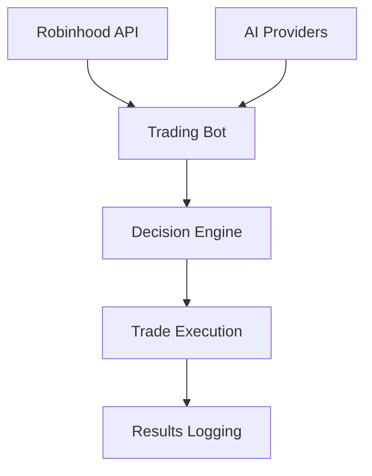
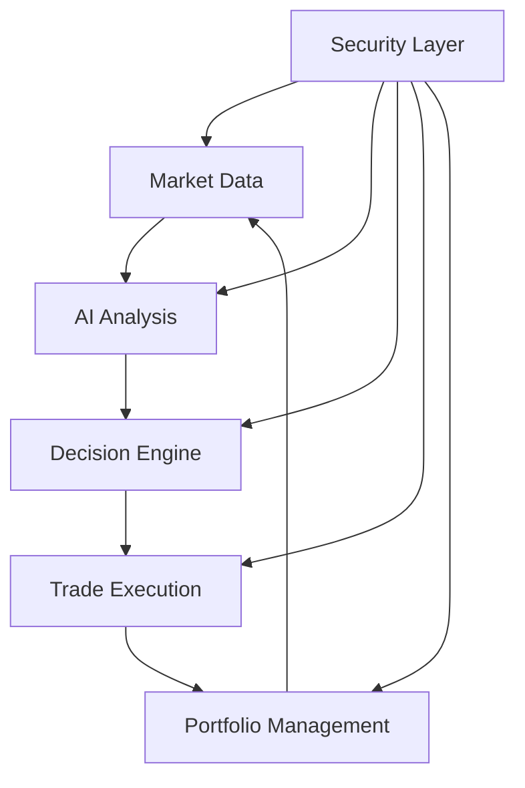

# Product Context

This file provides a high-level overview of the Robinhood AI Trading Bot project. Initial context gathered from project files on 2024-07-28 10:54:30.

## Project Goal
Automated stock trading system using AI decision-making with support for multiple AI providers (OpenAI, Deepseek, Requestly, OpenRouter) integrated with Robinhood trading platform.

## Key Features
- Multi-AI provider support with unified interface
- Robinhood API integration for trading
- AI decision making with constraints:
  - Portfolio limits
  - Trading amount guidelines
  - Exception lists
- Hallucination filtering
- Market-aware scheduling
- Demo mode support

## Overall Architecture

Key components:
- Main trading loop (main.py)
- AI provider interface (src/api/ai_provider.py)
- Robinhood integration (src/api/robinhood.py)
- Decision filtering logic
- Error handling system

## Project Goal
Create an AI-powered automated trading bot for Robinhood that makes data-driven investment decisions while maintaining security and compliance.

## Key Features
- AI-driven trading decisions
- Real-time market analysis
- Portfolio management
- Risk management controls
- Multiple operation modes (demo/manual/auto)
- Comprehensive logging and monitoring

## Overall Architecture

## Upcoming Architecture Improvements

### Execution Engine Enhancements
- **Retry Logic**: Automatic retries for failed API calls (3 attempts, exponential backoff)
- **Rate Limiting**: 60 calls/minute enforced via @limits decorator
- **Price Caching**: TTLCache for 5-minute price retention
- **Smart Routing**: Multi-factor route scoring (latency, cost, success rate)

### Risk Management System
- **Dynamic Stops**: ATR-based stop loss/take profit
- **Position Sizing**: Risk-per-trade calculation (2% of equity)
- **Exposure Checks**: Portfolio-wide risk limits

### Data Processing
- **Parallel Processing**: ProcessPoolExecutor for symbol data
- **Noise Filtering**: Kalman filter implementation
- **Anomaly Detection**: Isolation forest algorithm

## Summary of Upgrades

- **Integration with project management tools**
- **Memory bank visualization**
- **Automated backup system**
- **Automated memory bank synchronization**
- **Version history tracking**
- **README update script**
- **Validation checks for memory bank file formats**
- **Enhanced error handling**
- **Exponential backoff for external API calls**
- **Standardized update formats across documentation**
- **Added cross-references between memory bank files**
- **Integration with Robinhood API**
- **AI-driven trading decisions**
- **Real-time market analysis**
- **Portfolio management**
- **Risk management controls**
- **Multiple operation modes (demo/manual/auto)**
- **Comprehensive logging and monitoring**
- **Execution engine enhancements**
- **Risk management system**
- **Data processing improvements**
- **Upcoming architecture improvements**

2024-07-28 10:54:30 - Initial memory bank creation