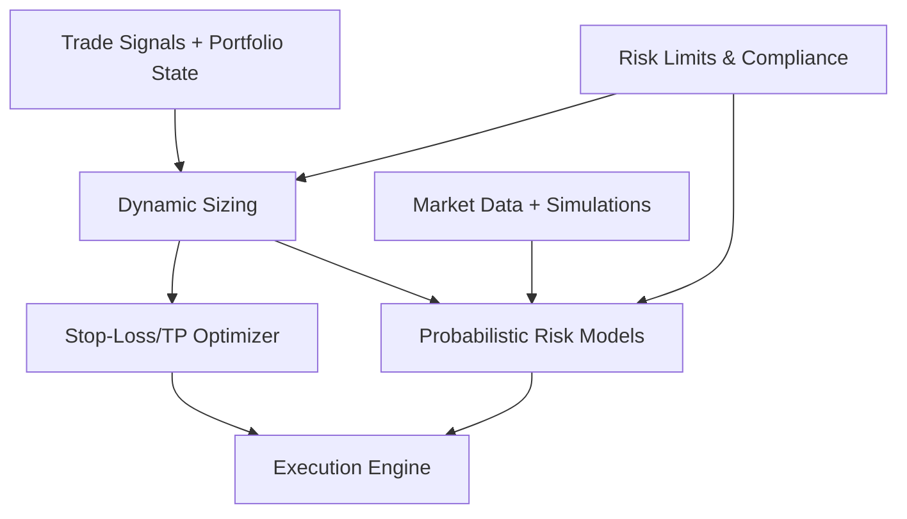

# Advanced Risk Management Layer Architecture

---

## Purpose

Continuously assess portfolio risk, optimize exits, and protect capital under all market conditions using probabilistic models and adaptive controls.

---

## Components

### Dynamic Position Sizing

- Based on Kelly Criterion, volatility, signal confidence, portfolio exposure
- Adjusts size dynamically to optimize growth and control risk

### Stop-Loss & Take-Profit Optimizer

- Trailing stops, ATR-based volatility stops
- Reinforcement learning for adaptive exit strategies
- Outputs dynamic stop-loss and take-profit levels

### Probabilistic Risk Models

- Monte Carlo simulations to model future scenarios
- Conditional Value at Risk (CVaR) for tail risk
- Scenario analysis for stress testing

### Portfolio Risk Aggregator

- Tracks total exposure, correlations, leverage, compliance
- Aggregates risk metrics across assets
- Enforces portfolio-level constraints

---

## Data Flow

---

## Algorithms & Techniques

- Kelly Criterion for sizing
- ATR and trailing stops for exits
- RL-based exit optimization
- Monte Carlo simulations
- CVaR calculations
- Correlation and exposure aggregation

---

## Interfaces

- Inputs: Trade signals, portfolio state, market data
- Outputs: Position sizes, stop-loss/take-profit levels, risk metrics
- APIs: Python classes, REST endpoints

---

## Notes

- Designed for real-time risk updates
- Modular for adding new risk models
- Logs all risk decisions for auditability

---

*Document created on 2025-04-04 05:18:28 by Roo Architect.*