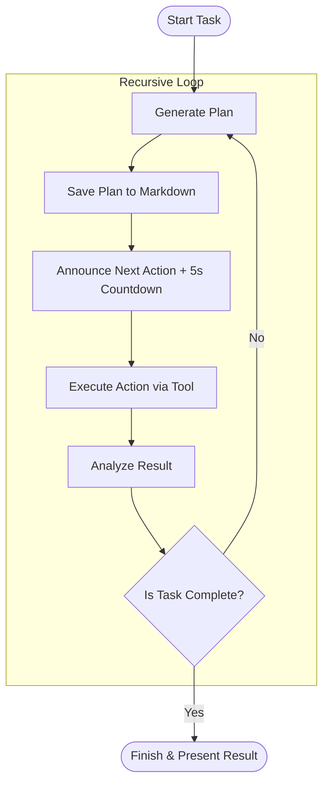

# Roo Autonomous Recursive Execution - Expanded Operational Plan

## 1. Autonomous Recursive Workflow Overview

---

## 2. Mode Switching Logic (Auto-Handoffs)

| Condition                               | Switch To   | Reason                                         |
|-----------------------------------------|-------------|------------------------------------------------|
| Task requires design expansion          | Architect   | Generate detailed plan                         |
| Plan ready for implementation           | Code        | Write or modify code                          |
| Code implemented, needs validation      | Test        | Run tests, validate behavior                  |
| Tests fail or bugs detected             | Debug       | Diagnose and fix issues                       |
| Documentation or explanation needed     | Ask         | Clarify, explain, or update docs              |
| Memory Bank update required (UMB)       | Default     | Override restrictions, sync Memory Bank       |
| Task fully complete                     | Attempt_Completion | Present final result                     |

---

## 3. Memory Bank Integration

- Save all plans, decisions, and progress into Markdown files.
- Log key events in `decisionLog.md`.
- Track focus and changes in `activeContext.md`.
- Log task progress in `progress.md`.
- Update `productContext.md` and `systemPatterns.md` as needed.
- Trigger UMB periodically to synchronize.

---

## 4. User Interaction Model

- Minimal prompts; only if critical info missing.
- 5-second countdown before major actions.
- User can interrupt countdown to halt.
- Otherwise, Roo proceeds autonomously.

---

## 5. Error Handling & Recovery

- On failure, analyze error, generate fix plan, loop back.
- Auto-switch to Debug if needed.
- Log issues and fixes.
- Re-plan in Architect mode if unexpected state.

---

## 6. Implementation Roadmap

1. Embed autonomy overlay (done).
2. Save this expanded plan (current step).
3. Auto-switch to Code mode (next).
4. Implement pending tasks recursively.
5. Loop until completion.
6. Present final result.