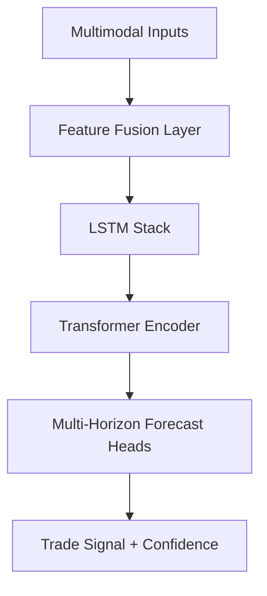

# Smart Adaptive Digital Asset Trading Agent Design

---

## 1. Multimodal Inputs

- **Market Data:** OHLCV across multiple timeframes (1m, 5m, 15m, 1h, 4h, 1d)
- **Technical Indicators:** EMA, RSI, MACD, Bollinger Bands, VWAP, Stochastic
- **Order Book:** Depth, spread, imbalance metrics
- **Sentiment:** Real-time social signals (Twitter, Reddit, Telegram)
- **News:** Event embeddings from headlines, RSS feeds (via BERT/NLP)
- **Blockchain:** Wallet flows, whale alerts, gas fees

---

## 2. Preprocessing & Feature Engineering

- Normalize and align all inputs temporally
- Derive momentum, volatility, liquidity zones
- Aggregate sentiment and news signals
- Encode events via transformer-based NLP
- Create multi-resolution sequences

---

## 3. Hybrid Neural Architecture

- **Feature Fusion Layer:** Concatenate/align multimodal features
- **Stacked LSTM:** Capture temporal dependencies
- **Transformer Encoder:** Model long-range and cross-modal interactions
- **Output Heads:**  
  - Short-term & mid-term price movement  
  - Setup classification (breakout, reversion, continuation)  
  - Confidence scores

---

## 4. Expected Behaviors

- Classify states: Accumulation, Expansion, Distribution, Reversion
- Detect breakouts/fakeouts via volume + structure
- Adaptive stop-loss & risk sizing
- Trigger API executions with dynamic sizing

---

## 5. Training Regime

- Use 20,000+ candles per asset, 10+ assets
- Multi-task loss:  
  - Forecasting (Huber/asymmetric loss)  
  - Setup classification (cross-entropy)  
  - Confidence calibration (entropy penalty)
- Reinforcement learning loop to optimize Sharpe, minimize drawdown
- Backtest across regimes: trending, volatile, sideways

---

## 6. Execution Layer

- Connect via REST/WebSocket APIs
- Rolling predictions every n candles
- Real-time stop-loss/take-profit triggers
- Adaptive exposure control

---

## 7. Optimization Targets

- Maximize return-to-risk ratio
- Minimize latency and overtrading
- Continuous adaptation to market drift
- Robustness across assets and regimes

---

## 8. Next Steps

- Implement multimodal data pipeline
- Build feature fusion + hybrid model
- Train on multi-asset datasets
- Integrate execution engine
- Set up RL tuning loop