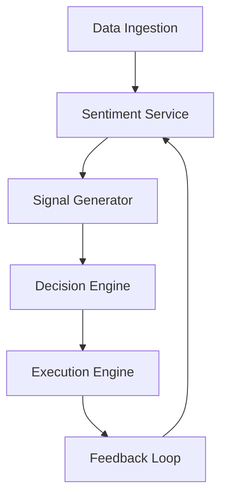

# Trading-Hero-LLM Integration & Deployment Plan

---

## 1. Module Integration Flow

---

## 2. API & Interface Specifications

### Data Ingestion (`data_ingestion.py`)
- `fetch_news() -> list[str]`
- `fetch_social_media() -> list[str]`
- `fetch_market_data() -> dict`

### Sentiment Service (`sentiment_service.py`)
- `analyze_sentiments(texts: list[str]) -> list[str]`

### Signal Generator (`signal_generator.py`)
- `generate_signals(sentiments: list[str], market_data: dict) -> dict`

### Decision Engine (`decision_engine.py`)
- `make_decision(signal_info: dict, portfolio_state: dict) -> dict`

### Execution Engine (`execution_engine.py`)
- `place_order(action: str, size: float) -> dict`

### Feedback Loop (`feedback_loop.py`)
- `log_trade(trade_details: dict)`
- `analyze_performance(trade_history: list[dict]) -> dict`
- `trigger_retraining(performance_metrics: dict) -> bool`

---

## 3. Orchestration Strategy

- **Batch Mode (MVP):**
  - Sequentially call modules in a loop.
  - Use in-memory data structures.
  - Log outputs to console or files.

- **Async/Event-Driven (Advanced):**
  - Use message queues (Redis, RabbitMQ, Kafka).
  - Trigger modules on new data arrival.
  - Enable parallel processing of ingestion, sentiment, signals.

- **Microservices (Future):**
  - Package modules as REST/gRPC services.
  - Use API Gateway for routing.
  - Deploy with Kubernetes or Docker Compose.

---

## 4. Deployment Architecture

### Local Development
- Run all modules as Python scripts.
- Use mock data or small datasets.
- Manual triggering.

### Staging/Testing
- Connect to sandbox broker APIs.
- Use real-time data feeds.
- Enable logging and monitoring.

### Production
- Deploy on cloud VM or Kubernetes cluster.
- Use secure API keys and secrets management.
- Enable autoscaling for ingestion and inference.
- Integrate with CI/CD pipelines.

---

## 5. Monitoring & Scaling

- **Metrics:** Latency, throughput, error rates, trade performance.
- **Logs:** Module outputs, errors, trade logs.
- **Alerts:** Failures, performance drops, risk breaches.
- **Scaling:**  
  - Horizontal for ingestion and inference.  
  - Vertical for decision and execution engines.

---

## 6. Next Steps

1. Implement API interfaces and wiring code.
2. Develop orchestration scripts (batch or async).
3. Containerize modules (Docker).
4. Set up CI/CD pipelines.
5. Integrate monitoring and alerting.
6. Test end-to-end flows in staging.

---

## Approval

Please review this plan. Once approved, proceed to implementation.