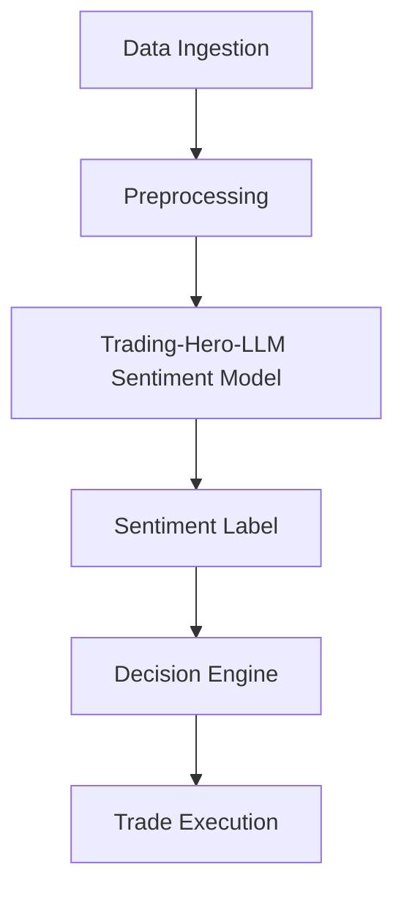

# Trading-Hero-LLM Integration Plan

---

## 1. Overview

**Trading-Hero-LLM** is a fine-tuned version of FinBERT designed for financial sentiment analysis. This plan outlines how to integrate it into the AI trading system for real-time sentiment-driven decision making.

---

## 2. Model Details

- **Base Model:** FinBERT (BERT pre-trained on financial texts)
- **Fine-tuning Dataset:**
  - Training: 10.9M tokens
  - Validation: 1.2M tokens
  - Test: 1.3M tokens
- **Pre-training Corpus:** 4.9B tokens (10-K, 10-Q, earnings calls, analyst reports)
- **Evaluation:**
  - Accuracy: 0.908
  - Precision: 0.928
  - Recall: 0.908
  - F1 Score: 0.913
- **Labels:** 0 = Neutral, 1 = Positive, 2 = Negative

---

## 3. Environment Setup

```bash
pip install transformers torch
```

---

## 4. Model Loading & Pipeline Creation

```python
from transformers import AutoTokenizer, AutoModelForSequenceClassification, pipeline

tokenizer = AutoTokenizer.from_pretrained("fuchenru/Trading-Hero-LLM")
model = AutoModelForSequenceClassification.from_pretrained("fuchenru/Trading-Hero-LLM")

nlp = pipeline("text-classification", model=model, tokenizer=tokenizer)
```

---

## 5. Preprocessing Function

```python
def preprocess(text, tokenizer, max_length=128):
    return tokenizer(text, truncation=True, padding='max_length', max_length=max_length, return_tensors='pt')
```

---

## 6. Prediction Function

```python
import torch

def predict_sentiment(input_text):
    inputs = tokenizer(input_text, return_tensors="pt", truncation=True, padding=True)
    with torch.no_grad():
        outputs = model(**inputs)
    predicted_label = torch.argmax(outputs.logits, dim=1).item()
    label_map = {0: 'neutral', 1: 'positive', 2: 'negative'}
    return label_map[predicted_label]
```

---

## 7. Sample Usage

```python
stock_news = [
    "Market analysts predict a stable outlook for the coming weeks.",
    "The market remained relatively flat today, with minimal movement in stock prices.",
    "Investor sentiment improved following news of a potential trade deal."
]

for news in stock_news:
    print("Predicted Sentiment:", predict_sentiment(news))
```

---

## 8. Integration Architecture



---

## 9. Integration Steps

1. **Ingest Data:** Collect financial news, reports, and social media feeds.
2. **Preprocess:** Clean and tokenize text using the `preprocess` function.
3. **Sentiment Analysis:** Use `predict_sentiment` to classify each text.
4. **Store Results:** Save sentiment labels with timestamps in the database.
5. **Decision Logic:** Incorporate sentiment into trading algorithms.
6. **Execute Trades:** Trigger buy/sell/hold actions based on combined signals.

---

## 10. Next Actions

- Review this plan.
- Approve or suggest modifications.
- Once approved, switch to **Code Mode** for implementation.