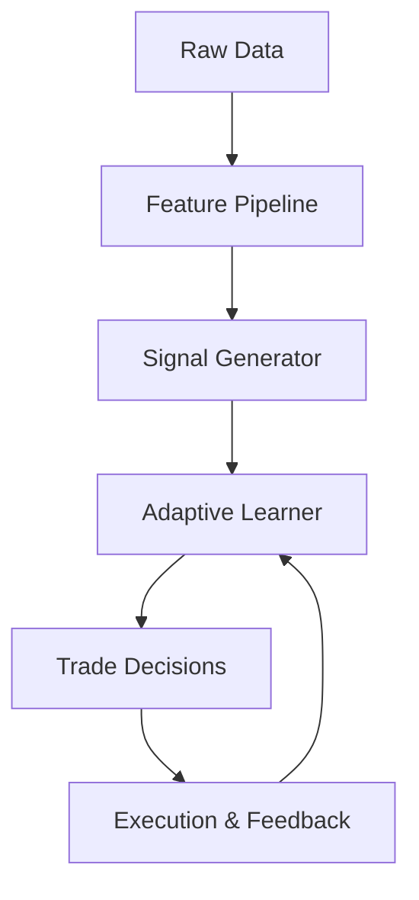

# Training Loop Integration Plan

## Data Flow

Raw Data → Feature Pipeline → Signal Generator → Adaptive Learner → Trade Decisions → Execution & Feedback → Adaptive Learner

## Training Loop Steps

1. **Fetch Data**  
   - Use `DataIngestion` async methods

2. **Transform Features**  
   - `features = feature_pipeline.transform(raw_data)`

3. **Generate Signals**  
   - `signals = signal_generator.generate_signals(features)`

4. **Update Adaptive Learner**  
   - `adaptive_learner.add_experience((signals, labels))`  
   - `adaptive_learner.update_model()`

5. **Evaluate Performance**  
   - `adaptive_learner.evaluate_performance(X_val, y_val, metric_fn)`

6. **Repeat** for new data batches

## System Flow Diagram

## Notes

- Pipeline supports batch and online modes  
- Async data fetch, sync feature transform  
- Labels = future returns or PnL flags  
- Feedback loop enables continual learning