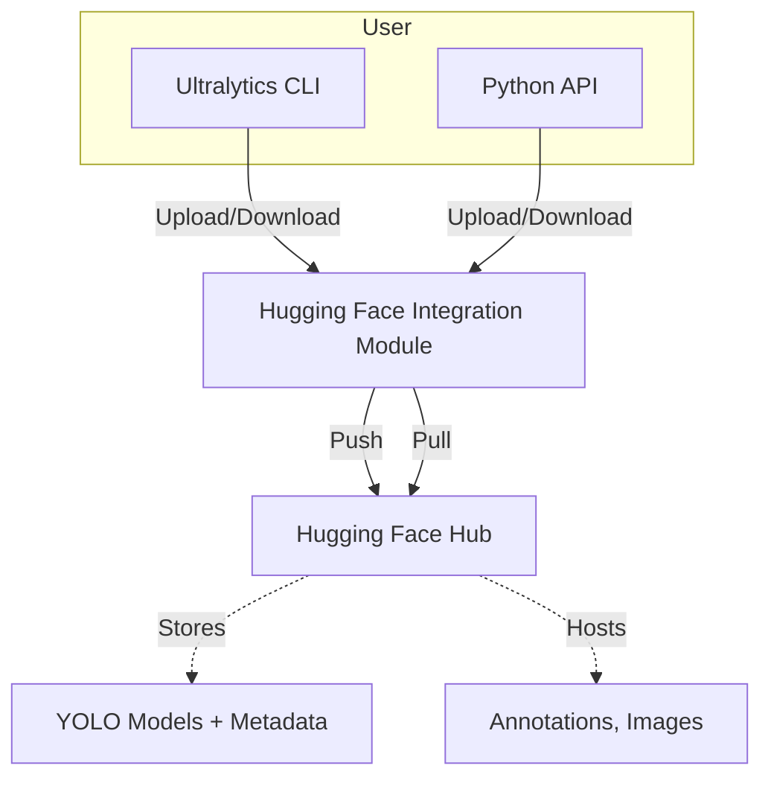

# Ultralytics - Hugging Face Integration Architecture

## Context
- Ultralytics currently **references datasets hosted on Hugging Face** via static URLs.
- There is **no built-in API integration** for pushing/pulling models or datasets.
- This plan outlines a **future-proof architecture** for **full integration**.

---

## Objectives
- Enable **uploading YOLO models** to Hugging Face Hub.
- Enable **downloading YOLO models** from Hugging Face Hub.
- Manage **datasets** via Hugging Face Hub.
- Support **CLI and Python API**.
- Ensure **secure authentication**.
- Provide **versioning and metadata management**.

---

## Architecture Diagram

---

## Integration Module

- **Location:** `ultralytics/hub/huggingface.py`
- **Dependencies:** `huggingface_hub`, `transformers`
- **Functions:**
  - `upload_model()`
  - `download_model()`
  - `generate_model_card()`
  - `list_models()`
- **Authentication:** via token (env var or CLI)

---

## CLI Commands

- `yolo hf-push --model path.pt --repo user/repo`
- `yolo hf-pull --repo user/repo`
- `yolo hf-list --user user`

---

## Security

- Use environment variables for tokens.
- Avoid hardcoding secrets.
- Document required token scopes.

---

## Testing

- Unit + integration tests.
- Mock HF Hub API.
- Error handling.

---

## Current State Summary

| Feature                     | Status                              |
|-----------------------------|-------------------------------------|
| Dataset hosting on HF       | Via static URLs in docs/configs     |
| Model push/pull integration | **Not implemented yet**             |
| API integration             | **Not implemented yet**             |
| CLI support                 | **Not implemented yet**             |

---

## Next Steps

- Implement integration module.
- Extend CLI.
- Add tests.
- Update documentation.

---

*Generated: 2025-04-06 12:29 London Time*