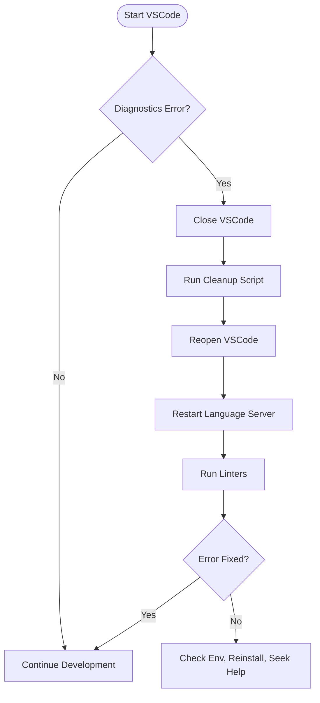

# Workspace Diagnostics Maintenance Plan

*Date: 2025-04-06 04:48 (UTC+1)*

---

## 1. Overview

This plan addresses transient workspace diagnostics errors in VSCode, such as:

> *Unable to resolve nonexistent file `/var/folders/.../robinhood-ai-trading-bot_mainXXXX`*

The goal is to **prevent**, **detect**, and **resolve** such issues efficiently.

---

## 2. Root Cause Recap

- Diagnostics reference stale or deleted temp files.
- Caused by interrupted analysis, cache corruption, or temp cleanup.
- Not embedded in project configs.

---

## 3. Automated Cleanup Script

Create a script `scripts/clean_vscode_cache.sh`:

```bash
#!/bin/bash
echo 'Cleaning VSCode workspace cache...'
rm -rf .vscode/.python* .vscode/__pycache__ .mypy_cache/ .pytest_cache/
find . -type d -name '__pycache__' -exec rm -rf {} +
echo 'Done. Please restart VSCode.'
```

**Usage:**  
Run before opening VSCode or if diagnostics errors appear.

---

## 4. VSCode Tasks Integration (Optional)

Add to `.vscode/tasks.json`:

```json
{
  "version": "2.0.0",
  "tasks": [
    {
      "label": "Clean Workspace Cache",
      "type": "shell",
      "command": "./scripts/clean_vscode_cache.sh",
      "problemMatcher": []
    }
  ]
}
```

Run via **Terminal > Run Task > Clean Workspace Cache**.

---

## 5. Developer Troubleshooting Checklist

- Close VSCode fully.
- Run cleanup script.
- Reopen VSCode.
- Reload window / restart language server.
- Run `flake8 .` or `pylint` manually.
- Verify Python interpreter.
- Reinstall dependencies if needed.

---

## 6. Onboarding Documentation Update

Add a section in `README.md` or `CONTRIBUTING.md`:

> ### Workspace Diagnostics Tips
> - If you see stale temp file errors, run the cleanup script.
> - Restart VSCode and language server.
> - See `workspace_diagnostics_maintenance_plan.md` for details.

---

## 7. Diagnostics Maintenance Workflow



---

## 8. Next Steps

- Implement the cleanup script.
- Optionally add VSCode task.
- Update onboarding docs.
- Share this plan with the team.

---

*End of Plan*